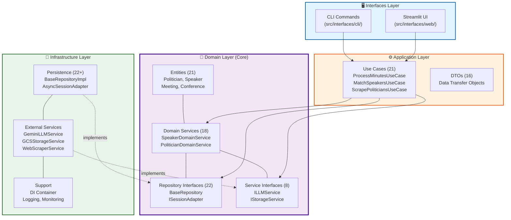
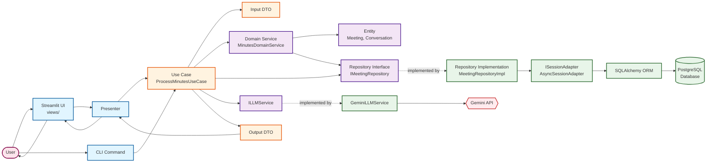
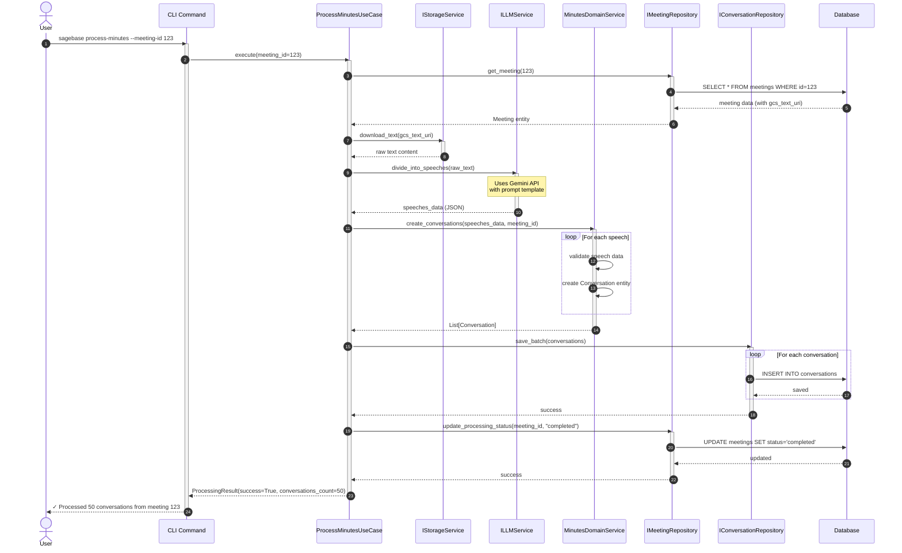
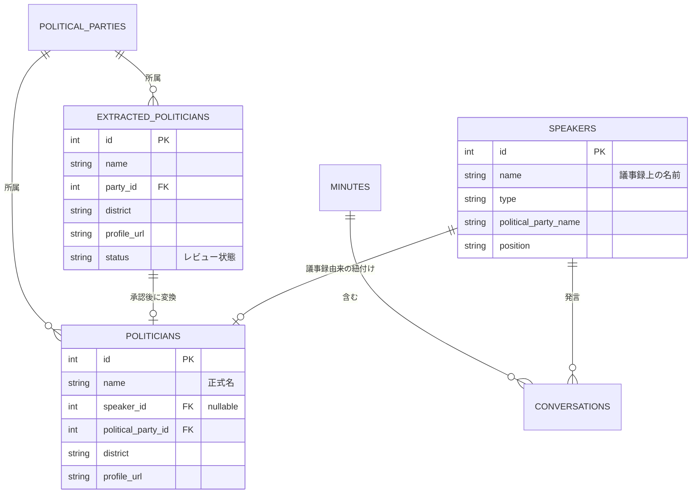

# Polibase アーキテクチャドキュメント

> 📚 **詳細な図とガイド**: [diagrams/](diagrams/) ディレクトリにすべてのアーキテクチャ図とその詳細な説明があります

## システム概要

Polibaseは日本の政治活動を追跡・分析するためのアプリケーションです。議事録からの発言抽出、政治家情報の管理、会議体メンバーの追跡などの機能を提供します。

## アーキテクチャ概要

本システムはClean Architectureの原則に基づいて設計されており、以下の4つの層から構成されています：

### レイヤー依存関係図

> 📖 詳細: [diagrams/layer-dependency.mmd](diagrams/layer-dependency.mmd)



**重要原則**:
- **依存性ルール**: 依存関係は内側（ドメイン層）に向かう
- **ドメイン独立性**: ドメイン層は外部フレームワークに依存しない
- **テスタビリティ**: 各層を独立してモック・テスト可能

## 層の詳細

### 1. ドメイン層 (Domain Layer)

ビジネスロジックとビジネスルールを含む、システムの中核となる層です。

#### 主要エンティティ

- **GoverningBody**: 開催主体（国、都道府県、市町村）
- **Conference**: 会議体（議会、委員会）
- **Meeting**: 会議の具体的な開催インスタンス
- **Speaker**: 議事録から抽出された発言者（議事録における政治家の表現を記録）
- **Politician**: 政治家マスタデータ（議事録由来または政党サイト由来）
- **ExtractedPolitician**: 政党サイトから抽出された政治家の中間データ（レビュー後にPoliticianに変換）
- **Conversation**: 発言内容
- **PoliticalParty**: 政党
- **ParliamentaryGroup**: 議員団（会派）

#### ドメインサービス

- **SpeakerDomainService**: 発言者関連のビジネスロジック
- **PoliticianDomainService**: 政治家関連のビジネスロジック
- **MinutesDomainService**: 議事録処理のビジネスロジック
- **ConferenceDomainService**: 会議体関連のビジネスロジック
- **ParliamentaryGroupDomainService**: 議員団関連のビジネスロジック

### 2. アプリケーション層 (Application Layer)

ユースケースの実装とビジネスフローの調整を行う層です。

#### 主要ユースケース

- **ProcessMinutesUseCase**: 議事録処理
- **MatchSpeakersUseCase**: 発言者と政治家のマッチング
- **ScrapePoliticiansUseCase**: 政治家情報のスクレイピング
- **ManageConferenceMembersUseCase**: 会議体メンバー管理

### 3. インフラストラクチャ層 (Infrastructure Layer)

外部システムとの連携を実装する層です。

#### コンポーネント

- **Persistence**: PostgreSQLデータベースアクセス（SQLAlchemy）
- **External Services**:
  - LLMService: Gemini APIとの連携
  - StorageService: Google Cloud Storageとの連携
  - WebScraperService: Webスクレイピング（Playwright）

### 4. インターフェース層 (Interfaces Layer)

ユーザーとのインタラクションを担当する層です。

#### コンポーネント

- **CLI**: コマンドラインインターフェース
- **Web**: Streamlit ベースのWeb UI

## コンポーネント相互作用

> 📖 詳細: [diagrams/component-interaction.mmd](diagrams/component-interaction.mmd)

以下の図は、典型的なリクエストフローにおけるコンポーネント間の相互作用を示しています：



**重要な設計パターン**:
- **依存性逆転**: ユースケースはインターフェースに依存、実装に依存しない
- **DTOパターン**: データ転送オブジェクトがドメインモデルの漏洩を防ぐ
- **リポジトリパターン**: データアクセスロジックを抽象化
- **アダプターパターン**: ISessionAdapterがSQLAlchemyセッションを適応

## データフロー

### 1. 議事録処理フロー

> 📖 詳細: [diagrams/data-flow-minutes-processing.mmd](diagrams/data-flow-minutes-processing.mmd)

このシーケンス図は、議事録PDF/テキストから構造化された会話データへの完全なフローを示しています：



**データ変換**: `PDF/Text → Raw Text → LLM JSON → Conversation Entities → Database Records`

### 2. 発言者マッチングフロー

> 📖 詳細: [diagrams/data-flow-speaker-matching.mmd](diagrams/data-flow-speaker-matching.mmd)

ルールベース + LLMハイブリッドアプローチによる発言者と政治家のマッチング：

**マッチング戦略**:
- **フェーズ1**: 発言者抽出（名前正規化、既存speaker検索、新規speaker作成）
- **フェーズ2**: 政治家マッチング（候補検索、LLMファジーマッチング、信頼度≥0.7で自動リンク）

**なぜLLMマッチングが必要か**:
日本語の議事録では名前の表記揺れが多い（例：山田太郎君、山田議員、山田太郎）

### 3. 政治家情報スクレイピングフロー

> 📖 詳細: [diagrams/data-flow-politician-scraping.mmd](diagrams/data-flow-politician-scraping.mmd)

政党Webサイトからの政治家データスクレイピングの3段階プロセス：

**3段階プロセス**:
1. **スクレイピング**: PlaywrightでWebページ取得、LLMで構造化データ抽出
2. **ステージング**: `extracted_politicians`テーブルに保存（status = pending）
3. **レビューと変換**: 管理者承認後、`politicians`テーブルに変換

**なぜステージングテーブルが必要か**:
1. 品質管理（マスターデータ追加前の人手レビュー）
2. エラー検出（LLM抽出ミスのキャッチ）
3. 重複防止（既存データとの確認）
4. 監査証跡（いつ何が抽出されたかの追跡）

## リポジトリパターン

> 📖 詳細: [diagrams/repository-pattern.mmd](diagrams/repository-pattern.mmd)

Polibaseのリポジトリパターン実装は、Clean Architectureの原則に従っています：

### 主要コンポーネント

**ドメイン層（抽象化）**:
- `BaseRepository[T]`: ジェネリックリポジトリインターフェース（共通CRUD操作）
- エンティティ固有リポジトリ: 特化したクエリメソッドを追加
- `ISessionAdapter`: データベースセッション管理の抽象化

**インフラストラクチャ層（実装）**:
- `BaseRepositoryImpl[T]`: ジェネリックSQLAlchemy実装
- 具体的な実装: 特化メソッドを実装（例：`MeetingRepositoryImpl.find_by_date_range()`）
- `AsyncSessionAdapter`: SQLAlchemy AsyncSessionのラッパー

### 設計の利点

1. **依存性逆転**: ユースケースはインターフェースに依存、実装には依存しない
2. **テスト容易性**: モックリポジトリで簡単にテスト可能
3. **フレームワーク独立性**: ドメイン層はSQLAlchemyを知らない
4. **一貫性のあるAPI**: すべてのリポジトリが共通インターフェースを共有
5. **Async/Await対応**: すべてのリポジトリメソッドが非同期

### エンティティ関係図



## 技術スタック

### バックエンド
- **言語**: Python 3.11+
- **フレームワーク**:
  - FastAPI (将来的なAPI実装用)
  - Streamlit (Web UI)
  - Click (CLI)
- **ORM**: SQLAlchemy 2.0
- **非同期処理**: asyncio

### データベース
- **RDBMS**: PostgreSQL 15
- **マイグレーション**: SQL ファイル管理

### 外部サービス
- **LLM**: Google Gemini API (gemini-2.0-flash)
- **ストレージ**: Google Cloud Storage
- **Webスクレイピング**: Playwright

### 開発ツール
- **パッケージ管理**: UV
- **コンテナ**: Docker, Docker Compose
- **コード品質**: Ruff, Pyright
- **テスト**: pytest, pytest-asyncio

## セキュリティ考慮事項

1. **APIキー管理**
   - 環境変数による管理
   - .envファイルはGit管理外

2. **データアクセス**
   - リポジトリパターンによるアクセス制御
   - SQLインジェクション対策（SQLAlchemy使用）

3. **外部サービス連携**
   - APIキーの適切な管理
   - レート制限の考慮

## パフォーマンス考慮事項

1. **非同期処理**
   - I/O処理の非同期化
   - 並行処理による高速化

2. **キャッシング**
   - Webスクレイピング結果のキャッシュ
   - LLM呼び出し結果のキャッシュ

3. **バッチ処理**
   - 大量データの分割処理
   - プログレス表示

## 拡張性

1. **新しい外部サービスの追加**
   - インターフェースを定義
   - インフラストラクチャ層に実装を追加

2. **新しいエンティティの追加**
   - ドメイン層にエンティティを定義
   - 対応するリポジトリインターフェースを作成

3. **新しいユースケースの追加**
   - アプリケーション層にユースケースを実装
   - 必要に応じてDTOを定義

## クラウドアーキテクチャ (Google Cloud Platform)

> 📖 詳細図: [diagrams/cloud-architecture.mmd](diagrams/cloud-architecture.mmd)

PolibaseシステムをGoogle Cloud Platform上で運用するためのアーキテクチャ設計です。サーバーレス、スケーラブル、コスト最適化を重視した構成となっています。

### アーキテクチャ図

```mermaid
graph TB
    %% External Users & Clients
    subgraph external["🌐 External"]
        USERS([End Users])
        ADMIN([Administrators])
        COUNCILS([Council Websites])
        PARTY_SITES([Political Party Sites])
    end

    %% Internet Edge
    subgraph edge["🛡️ Edge Layer"]
        CLB[Cloud Load Balancer<br/>HTTPS/SSL Termination]
        CDN[Cloud CDN<br/>Static Assets]
    end

    %% Application Layer (Cloud Run)
    subgraph cloudrun["☁️ Cloud Run (Serverless Containers)"]
        direction TB
        subgraph cr_web["Web Application"]
            STREAMLIT[Streamlit UI<br/>Port 8501]
            MONITOR[Monitoring Dashboard<br/>Port 8502]
        end

        subgraph cr_workers["Background Workers"]
            SCRAPER_WORKER[Scraper Worker<br/>議事録スクレイピング]
            PROCESSOR_WORKER[Minutes Processor<br/>LLM処理]
            MATCHER_WORKER[Speaker Matcher<br/>マッチング処理]
        end

        subgraph cr_api["API Service (Future)"]
            API[FastAPI<br/>REST/GraphQL]
        end
    end

    %% Data Layer
    subgraph data["💾 Data Layer"]
        direction TB

        subgraph cloudsql["Cloud SQL"]
            POSTGRES[(PostgreSQL 15<br/>Primary Instance)]
            REPLICA[(Read Replica<br/>レポート用)]
        end

        subgraph gcs["Google Cloud Storage"]
            GCS_MINUTES[Scraped Minutes<br/>gs://sagebase-minutes/]
            GCS_BACKUPS[DB Backups<br/>gs://sagebase-backups/]
            GCS_EXPORTS[Data Exports<br/>gs://sagebase-exports/]
        end
    end

    %% External AI Services
    subgraph ai["🤖 AI Services"]
        VERTEX_AI[Vertex AI<br/>Gemini 2.0 Flash<br/>Gemini 1.5 Flash]
        GEMINI_API[Gemini API<br/>Fallback Option]
    end

    %% Infrastructure Services
    subgraph infra["🔧 Infrastructure Services"]
        direction TB
        SECRET[Secret Manager<br/>API Keys & Credentials]
        VPC[VPC Network<br/>Private Network]

        subgraph monitoring["Monitoring & Logging"]
            CLOUD_LOG[Cloud Logging<br/>Structured Logs]
            CLOUD_MON[Cloud Monitoring<br/>Metrics & Alerts]
            CLOUD_TRACE[Cloud Trace<br/>Distributed Tracing]
            SENTRY[Sentry<br/>Error Tracking]
        end

        subgraph cicd["CI/CD (Future)"]
            CLOUD_BUILD[Cloud Build<br/>Container Builds]
            ARTIFACT[Artifact Registry<br/>Container Images]
        end
    end

    %% Network Connections
    USERS --> CLB
    ADMIN --> CLB
    CLB --> STREAMLIT
    CLB --> MONITOR
    CLB --> API

    STREAMLIT --> PROCESSOR_WORKER
    STREAMLIT --> SCRAPER_WORKER
    STREAMLIT --> MATCHER_WORKER
    API --> PROCESSOR_WORKER

    %% Data Access
    STREAMLIT --> POSTGRES
    MONITOR --> REPLICA
    API --> POSTGRES
    SCRAPER_WORKER --> POSTGRES
    PROCESSOR_WORKER --> POSTGRES
    MATCHER_WORKER --> POSTGRES

    %% External Data Sources
    SCRAPER_WORKER -.scrapes.-> COUNCILS
    SCRAPER_WORKER -.scrapes.-> PARTY_SITES

    %% Storage Access
    SCRAPER_WORKER --> GCS_MINUTES
    PROCESSOR_WORKER --> GCS_MINUTES
    PROCESSOR_WORKER --> GCS_EXPORTS

    %% AI Service Access
    PROCESSOR_WORKER --> VERTEX_AI
    MATCHER_WORKER --> VERTEX_AI
    PROCESSOR_WORKER -.fallback.-> GEMINI_API

    %% Infrastructure Connections
    cr_web -.uses.-> SECRET
    cr_workers -.uses.-> SECRET
    cr_api -.uses.-> SECRET

    cloudrun -.runs in.-> VPC
    cloudsql -.private IP.-> VPC

    %% Monitoring Connections
    cloudrun --> CLOUD_LOG
    cloudrun --> CLOUD_MON
    cloudrun --> CLOUD_TRACE
    cloudrun -.errors.-> SENTRY

    %% Backup Process
    POSTGRES -.automated backup.-> GCS_BACKUPS

    %% CI/CD Flow (Future)
    CLOUD_BUILD -.builds.-> ARTIFACT
    ARTIFACT -.deploys.-> cloudrun

    %% Styling
    classDef externalStyle fill:#ffebee,stroke:#c62828,stroke-width:2px
    classDef edgeStyle fill:#e3f2fd,stroke:#1565c0,stroke-width:2px
    classDef computeStyle fill:#e8f5e9,stroke:#2e7d32,stroke-width:2px
    classDef dataStyle fill:#fff3e0,stroke:#e65100,stroke-width:2px
    classDef aiStyle fill:#f3e5f5,stroke:#6a1b9a,stroke-width:2px
    classDef infraStyle fill:#fce4ec,stroke:#880e4f,stroke-width:2px

    class external externalStyle
    class edge edgeStyle
    class cloudrun,cr_web,cr_workers,cr_api computeStyle
    class data,cloudsql,gcs dataStyle
    class ai aiStyle
    class infra,monitoring,cicd infraStyle
```



### 使用するGCPサービス

#### コンピューティング

1. **Cloud Run**
   - **用途**: Webアプリケーション、バックグラウンドワーカー、API
   - **特徴**:
     - サーバーレス、フルマネージド
     - 自動スケーリング（0〜∞インスタンス）
     - コンテナベース（既存Dockerfileを活用）
     - リクエストベース課金（アイドル時は無料）
   - **デプロイメント**:
     - `streamlit-ui`: Streamlit Web UI (ポート8501)
     - `monitoring-dashboard`: 監視ダッシュボード (ポート8502)
     - `scraper-worker`: 議事録スクレイピングワーカー
     - `processor-worker`: LLM議事録処理ワーカー
     - `matcher-worker`: 発言者マッチングワーカー
     - `api-service`: FastAPI (将来実装)

#### データベース

2. **Cloud SQL for PostgreSQL**
   - **構成**:
     - プライマリインスタンス: PostgreSQL 15
     - リードレプリカ: レポート・分析用（オプション）
   - **スペック**:
     - 本番環境: db-custom-4-16384 (vCPU 4, メモリ 16GB)
     - 開発環境: db-f1-micro (vCPU 1, メモリ 0.6GB)
   - **機能**:
     - 自動バックアップ（毎日、7日間保持）
     - ポイントインタイムリカバリ (PITR)
     - 自動フェイルオーバー（高可用性構成）
     - プライベートIP（VPC経由）
   - **接続**:
     - Cloud Run → Cloud SQL Auth Proxy（自動、サーバーレス）
     - セキュアな接続（SSL/TLS）

#### ストレージ

3. **Google Cloud Storage**
   - **バケット構成**:
     - `sagebase-minutes`: スクレイピングした議事録PDF/テキスト
     - `sagebase-backups`: データベースバックアップ
     - `sagebase-exports`: データエクスポート（CSV等）
   - **アクセス制御**:
     - バケット単位のIAMポリシー
     - Cloud Runサービスアカウント経由のアクセス
   - **ライフサイクル管理**:
     - 90日後にNearlineストレージクラスへ移行
     - 1年後にColdlineストレージクラスへ移行
     - 古いバックアップは自動削除（3年保持）

#### AI/機械学習

4. **Vertex AI**
   - **モデル**:
     - Gemini 2.0 Flash: メイン処理用（高速、低コスト）
     - Gemini 1.5 Flash: フォールバック用
   - **利点**:
     - Google Cloudとのシームレスな統合
     - プライベートエンドポイント（VPC経由）
     - 企業向けSLA
     - より高いレート制限
   - **代替オプション**:
     - Gemini API: 開発・テスト環境用

#### セキュリティ

5. **Secret Manager**
   - **管理するシークレット**:
     - `GOOGLE_API_KEY`: Gemini APIキー
     - `DATABASE_PASSWORD`: PostgreSQL接続パスワード
     - `SENTRY_DSN`: Sentryエラートラッキング設定
     - その他API キー・認証情報
   - **アクセス制御**:
     - サービスアカウント単位のIAM権限
     - Secret Managerアクセスログ
     - バージョン管理（ローテーション対応）

#### ネットワーク

6. **VPC Network**
   - **構成**:
     - カスタムVPC: `sagebase-vpc`
     - サブネット: 各リージョンに配置
     - プライベートサービス接続（Cloud SQL用）
   - **セキュリティ**:
     - ファイアウォールルール
     - Cloud Runサービス間のプライベート通信
     - インターネット向けはCloud Load Balancer経由のみ

7. **Cloud Load Balancer**
   - **機能**:
     - HTTPS/SSL終端
     - グローバルロードバランシング
     - Cloud Armorとの統合（DDoS対策）
     - Cloud CDNとの統合（静的アセット配信）

#### 監視・ログ

8. **Cloud Logging**
   - **収集対象**:
     - アプリケーションログ（構造化ログ）
     - Cloud Runコンテナログ
     - Cloud SQLログ
     - アクセスログ（Load Balancer）
   - **保持期間**: 30日（デフォルト）、必要に応じて延長

9. **Cloud Monitoring**
   - **メトリクス**:
     - Cloud Runメトリクス（リクエスト数、レイテンシ、CPU、メモリ）
     - Cloud SQLメトリクス（接続数、クエリ実行時間）
     - カスタムメトリクス（OpenTelemetry経由）
   - **アラート**:
     - エラー率閾値超過
     - レスポンス時間の増加
     - データベース接続エラー
     - ストレージ使用量超過

10. **Cloud Trace**
    - **分散トレーシング**:
      - リクエストフロー全体の可視化
      - ボトルネック特定
      - OpenTelemetry統合

11. **Sentry（サードパーティ）**
    - **エラートラッキング**:
      - 詳細なエラーレポート
      - スタックトレース
      - ユーザーコンテキスト
      - リリース追跡

#### CI/CD（将来実装）

12. **Cloud Build**
    - **ビルドパイプライン**:
      - GitHub連携（プッシュ時自動ビルド）
      - Docker イメージビルド
      - テスト実行（pytest, ruff, pyright）
      - Artifact Registryへのpush

13. **Artifact Registry**
    - **コンテナイメージ管理**:
      - Docker イメージの保存
      - 脆弱性スキャン
      - イメージのバージョン管理

### ネットワーク構成

#### インターネット公開

```
Internet
    ↓
Cloud Load Balancer (HTTPS/SSL)
    ↓
Cloud CDN (静的アセット)
    ↓
Cloud Run Services
    ├─ streamlit-ui (8501)
    ├─ monitoring-dashboard (8502)
    └─ api-service (8000)
```

#### プライベートネットワーク

```
VPC Network (sagebase-vpc)
    ├─ Cloud Run Services
    │   └─ サービス間通信（プライベート）
    │
    ├─ Cloud SQL (プライベートIP)
    │   ├─ Primary Instance
    │   └─ Read Replica
    │
    └─ Vertex AI (プライベートエンドポイント)
```

#### 外部接続

```
Cloud Run Workers
    ↓ (HTTPS)
External Websites
    ├─ 議会サイト（kaigiroku.net等）
    └─ 政党Webサイト
```

### セキュリティ設計

#### 認証・認可

1. **ユーザー認証（将来実装）**
   - Identity Platform（Firebase Authentication）
   - OAuth 2.0 / OIDC
   - ロールベースアクセス制御 (RBAC)

2. **サービス間認証**
   - サービスアカウント
   - Workload Identity（推奨）
   - IAMロール・権限の最小権限の原則

#### データ保護

1. **暗号化**
   - **転送時**: TLS 1.3（すべてのHTTPS通信）
   - **保存時**:
     - Cloud SQL: デフォルトで暗号化
     - GCS: デフォルトで暗号化
     - Secret Manager: デフォルトで暗号化

2. **アクセス制御**
   - Cloud IAMポリシー
   - バケット単位のアクセス制御
   - データベース行レベルセキュリティ（RLS、将来実装）

#### ネットワークセキュリティ

1. **ファイアウォール**
   - VPCファイアウォールルール
   - Cloud Armor（DDoS対策、WAF）
   - 許可リスト/拒否リストによるアクセス制御

2. **Private Service Connect**
   - Cloud SQLへのプライベート接続
   - Vertex AIへのプライベートエンドポイント
   - インターネット経由の接続を回避

#### シークレット管理

1. **Secret Manager**
   - API キーの集中管理
   - 自動ローテーション（サポートされるシークレット）
   - アクセスログの監査

2. **環境変数**
   - Cloud Runの環境変数からSecret Managerを参照
   - コンテナイメージにシークレットを含めない

### データフロー

#### 議事録処理フロー（クラウド版）

```
1. Web Scraping
   Council Website
   → Scraper Worker (Cloud Run)
   → GCS (議事録PDF/テキスト保存)
   → Database (meetings テーブル更新)

2. LLM Processing
   User Request (Streamlit UI)
   → Processor Worker (Cloud Run)
   → GCS (議事録テキスト取得)
   → Vertex AI (Gemini API: テキスト分割・構造化)
   → Database (conversations テーブル保存)

3. Speaker Matching
   Automatic Trigger
   → Matcher Worker (Cloud Run)
   → Database (speakers, politicians 取得)
   → Vertex AI (Gemini API: ファジーマッチング)
   → Database (speaker リンク更新)

4. Monitoring & Reporting
   User Access (Monitoring Dashboard)
   → Cloud Run (監視ダッシュボード)
   → Cloud SQL Read Replica (分析クエリ)
   → 可視化 (Plotly, Folium)
```

#### 外部データ収集フロー

```
1. 政党メンバースクレイピング
   Party Website
   → Scraper Worker (Cloud Run)
   → Vertex AI (構造化データ抽出)
   → Database (extracted_politicians テーブル)
   → 管理者レビュー (Streamlit UI)
   → Database (politicians テーブル)

2. 会議体メンバー抽出
   Conference Website
   → Scraper Worker (Cloud Run)
   → Vertex AI (メンバー情報抽出)
   → Database (extracted_conference_members テーブル)
   → Vertex AI (政治家マッチング)
   → Database (politician_affiliations テーブル)
```

### ローカル環境との違い

| 項目 | ローカル環境 (Docker Compose) | クラウド環境 (GCP) |
|------|-------------------------------|---------------------|
| **コンピューティング** | Dockerコンテナ（単一ホスト） | Cloud Run（サーバーレス、自動スケール） |
| **データベース** | PostgreSQL 15 (Dockerコンテナ) | Cloud SQL for PostgreSQL 15 (マネージド) |
| **ストレージ** | ローカルファイルシステム + GCS（オプション） | Google Cloud Storage（メイン） |
| **LLM** | Gemini API（直接アクセス） | Vertex AI（推奨）または Gemini API |
| **ネットワーク** | localhost、ポート公開 | VPC、Cloud Load Balancer、プライベートIP |
| **シークレット** | .env ファイル | Secret Manager |
| **監視** | ローカルログ、Streamlit監視アプリ | Cloud Logging, Cloud Monitoring, Sentry |
| **スケーリング** | 手動、単一インスタンス | 自動、0〜∞インスタンス |
| **可用性** | 単一障害点（SPoF） | 高可用性構成、自動フェイルオーバー |
| **バックアップ** | 手動スクリプト | 自動バックアップ、PITR |
| **デプロイ** | docker compose up | Cloud Build → Artifact Registry → Cloud Run |
| **コスト** | サーバーコスト（固定） | 使用量ベース課金（従量制） |

#### 開発環境のバリエーション比較

| 項目 | ローカル (Docker) | GCP 常時稼働 | GCP GCSダンプ方式 ⭐ |
|------|------------------|-------------|---------------------|
| **起動時間** | 即座 | 1-2分 | 10-15分（初回）、1-2分（2回目以降） |
| **月額コスト** | サーバー代（固定） | $50-150 | $0.02（停止時）+ 日割り |
| **年間コスト** | サーバー代 | $600-1,800 | $24-96（週1日利用） |
| **データ保持** | ローカルディスク | Cloud SQL | GCS（完全保持） |
| **バックアップ** | 手動 | 自動（7日間） | 自動（無期限、履歴付き） |
| **スケーラビリティ** | なし | 高 | 中（起動時のみ） |
| **可用性** | 低 | 高 | 中（起動必要） |
| **適用ケース** | ローカル開発 | 本番、頻繁な利用 | 週1回以下の開発 |
| **推奨度** | 個人開発 | 本番環境 | コスト重視の開発 ⭐ |

### コスト見積もり

#### 月額コスト試算（想定ワークロード）

**前提条件**:
- 月間処理議事録: 100件
- 月間アクティブユーザー: 50名
- LLM API呼び出し: 約5,000回/月
- データベースサイズ: 50GB
- ストレージ使用量: 100GB

| サービス | 構成 | 月額コスト（USD） | 備考 |
|---------|------|-------------------|------|
| **Cloud Run** |  |  |  |
| - Streamlit UI | vCPU 1, メモリ 2GB, 常時1インスタンス | $35 | 月間730時間稼働 |
| - 監視ダッシュボード | vCPU 1, メモリ 2GB, 常時1インスタンス | $35 | 月間730時間稼働 |
| - Workers | vCPU 2, メモリ 4GB, 100時間/月 | $15 | オンデマンド実行 |
| **Cloud SQL** |  |  |  |
| - Primary | db-custom-2-8192 (vCPU 2, 8GB) | $150 | 高可用性構成 |
| - Storage | 50GB SSD | $10 |  |
| - Backup | 50GB | $3 |  |
| **Cloud Storage** |  |  |  |
| - Standard Class | 100GB | $2.5 |  |
| - Operations | クラスA: 1000回, クラスB: 10000回 | $0.05 |  |
| **Vertex AI (Gemini)** |  |  |  |
| - API Calls | 5,000回/月（入力2M文字、出力500K文字） | $20 | Flash モデル使用 |
| **Networking** |  |  |  |
| - Egress | 10GB/月 | $1.2 | GCPからインターネットへ |
| - Load Balancer | リクエスト10万回/月 | $20 |  |
| **Secret Manager** | 10 secrets, 10,000 accesses | $0.2 |  |
| **Cloud Logging** | 10GB/月 | $5 | 30日保持 |
| **Cloud Monitoring** | メトリクス 100系列 | $2 |  |
| **Sentry** | 無料プラン or チームプラン | $0-26 | エラー数による |
| **合計** |  | **$298 - $324** | 約 ¥45,000 - ¥49,000 (1USD=¥150換算) |

#### コスト最適化戦略

1. **開発環境（通常運用）**
   - Cloud SQLをdb-f1-microに変更 → $15/月
   - Cloud Runを最小インスタンスに設定 → $10/月
   - 開発環境合計: 約$50-70/月

2. **本番環境の最適化**
   - Cloud Runの最小インスタンス数を0に設定（夜間停止） → -$20/月
   - GCSライフサイクル管理（古いデータをColdline移行） → -$1/月
   - Cloud SQL Read Replicaは必要時のみ作成 → -$150/月（オプション）

3. **GCSダンプ方式（超低コスト開発環境）** ⭐ 推奨

   週1回以下の利用頻度で、とにかくコストを抑えたい場合に最適な方式です。

   **概要**:
   - 使用時: Cloud SQLインスタンスを作成してGCSから復元
   - 終了時: GCSにバックアップしてCloud SQLインスタンスを削除
   - 停止中: GCSストレージ課金のみ（約$0.02/月）

   **コスト比較**:

   | 運用方法 | 停止時コスト | 稼働時コスト | 年間コスト（週1日利用） |
   |---------|-------------|-------------|---------------------|
   | 常時稼働 | $150/月 | $150/月 | $1,800 |
   | 停止運用（activation-policy） | $10/月 | $150/月 | $120-360 |
   | **GCSダンプ方式** | **$0.02/月** | **日割り** | **$24-96** |

   **運用フロー**:
   ```bash
   # 作業開始（初回: 10-15分、2回目以降: 1-2分）
   just cloud-up
   # または
   ./scripts/cloud/setup-dev-env.sh

   # 作業実施...

   # 作業終了（5-10分）
   just cloud-down
   # または
   ./scripts/cloud/teardown-dev-env.sh
   ```

   **メリット**:
   - ✅ 使用しない期間は完全に$0（GCS課金$0.02のみ）
   - ✅ データは完全に保持される
   - ✅ バックアップ履歴が自動管理される
   - ✅ 複数の復元ポイントを保持可能
   - ✅ 年間約$1,700-2,800削減（週1日利用の場合）

   **デメリット**:
   - ⚠️ 初回起動に10-15分かかる
   - ⚠️ バックアップ・復元の待ち時間が発生
   - ⚠️ 完全自動化には不向き

   **推奨ケース**:
   - 週1回以下の利用頻度
   - 開発・テスト環境
   - 個人プロジェクト
   - コスト最優先

   **非推奨ケース**:
   - 毎日使用する
   - すぐに起動したい
   - CI/CDでの自動実行

   **実装詳細**:
   - スクリプト: `scripts/cloud/`
   - ドキュメント: `scripts/cloud/README.md`
   - バックアップ保存先: `gs://sagebase-backups/database-snapshots/`
   - 自動化: Justfileコマンド（`cloud-up`, `cloud-down`, `cloud-status`）

4. **スケーラビリティ対応**
   - アクセス増加時もCloud Runが自動スケール（コスト増は従量制）
   - LLM処理はキャッシング活用で呼び出し削減
   - データベースはリードレプリカで読み取り負荷分散

### デプロイメント戦略

#### 開発環境（GCSダンプ方式） - 推奨

週1回以下の利用頻度の場合、この方式が最もコスト効率が良いです。

1. **初回セットアップ**
   ```bash
   # 環境変数を設定
   export GCP_PROJECT_ID="your-project-id"
   export GCP_REGION="asia-northeast1"
   export GCS_BUCKET_NAME="sagebase-backups"

   # GCSバケット作成（バックアップ保存用）
   gsutil mb -p $GCP_PROJECT_ID \
     -c STANDARD \
     -l $GCP_REGION \
     gs://$GCS_BUCKET_NAME

   # 開発環境起動（初回は空のDBが作成される）
   just cloud-up
   ```

2. **日常的な使用**
   ```bash
   # 作業開始
   just cloud-up          # GCSから自動復元（10-15分）

   # 作業...

   # 作業終了
   just cloud-down        # GCSへ自動バックアップ＋削除（5-10分）
   ```

3. **バックアップ管理**
   ```bash
   # バックアップ一覧表示
   just cloud-backups

   # 環境状態確認
   just cloud-status
   ```

**詳細**: `scripts/cloud/README.md` を参照

#### 本番環境（常時稼働）

本番環境または毎日使用する開発環境の場合は、この方式を推奨します。

1. **インフラ構築（Terraform推奨）**
   ```bash
   # VPC作成
   gcloud compute networks create sagebase-vpc --subnet-mode=custom

   # Cloud SQL作成（本番環境）
   gcloud sql instances create sagebase-db \
     --database-version=POSTGRES_15 \
     --tier=db-custom-2-8192 \
     --region=asia-northeast1

   # または開発環境（低スペック）
   gcloud sql instances create sagebase-dev-db \
     --database-version=POSTGRES_15 \
     --tier=db-f1-micro \
     --region=asia-northeast1

   # GCSバケット作成
   gcloud storage buckets create gs://sagebase-minutes
   gcloud storage buckets create gs://sagebase-backups
   ```

2. **シークレット設定**
   ```bash
   # Secret Manager登録
   echo -n "your-api-key" | gcloud secrets create GOOGLE_API_KEY --data-file=-
   gcloud secrets add-iam-policy-binding GOOGLE_API_KEY \
     --member=serviceAccount:sagebase-sa@PROJECT_ID.iam.gserviceaccount.com \
     --role=roles/secretmanager.secretAccessor
   ```

3. **Cloud Runデプロイ**
   ```bash
   # コンテナビルド
   gcloud builds submit --tag gcr.io/PROJECT_ID/sagebase-ui

   # Cloud Runデプロイ
   gcloud run deploy streamlit-ui \
     --image gcr.io/PROJECT_ID/sagebase-ui \
     --platform managed \
     --region asia-northeast1 \
     --set-secrets=GOOGLE_API_KEY=GOOGLE_API_KEY:latest \
     --set-cloudsql-instances=PROJECT_ID:asia-northeast1:sagebase-db
   ```

#### 継続的デプロイ（CI/CD）

```yaml
# cloudbuild.yaml (例)
steps:
  # テスト
  - name: 'gcr.io/PROJECT_ID/sagebase-ci'
    args: ['uv', 'run', 'pytest']

  # ビルド
  - name: 'gcr.io/cloud-builders/docker'
    args: ['build', '-t', 'gcr.io/PROJECT_ID/sagebase-ui', '.']

  # プッシュ
  - name: 'gcr.io/cloud-builders/docker'
    args: ['push', 'gcr.io/PROJECT_ID/sagebase-ui']

  # デプロイ
  - name: 'gcr.io/cloud-builders/gcloud'
    args:
      - 'run'
      - 'deploy'
      - 'streamlit-ui'
      - '--image=gcr.io/PROJECT_ID/sagebase-ui'
      - '--region=asia-northeast1'
```

### 災害復旧（DR）

1. **RPO/RTO目標**
   - RPO (Recovery Point Objective): 1時間
   - RTO (Recovery Time Objective): 4時間

2. **バックアップ戦略**
   - **データベース**: Cloud SQLの自動バックアップ（毎日、7日保持）+ PITR
   - **ストレージ**: GCSのバージョニング + 複数リージョンレプリケーション
   - **設定**: Terraform state in GCS + バージョン管理

3. **リカバリ手順**
   - データベース: Cloud SQLコンソールからポイントインタイムリカバリ
   - ストレージ: GCSバケットのバージョン復元
   - アプリケーション: Cloud Buildから過去のイメージを再デプロイ

## 今後の改善計画

1. **DIコンテナの導入**
   - 依存性注入の自動化
   - テストの容易化

2. **イベント駆動アーキテクチャ**
   - ドメインイベントの実装
   - 非同期メッセージング（Cloud Pub/Sub）

3. **API層の実装**
   - RESTful API
   - GraphQL対応
   - Cloud Endpoints / API Gatewayとの統合

4. **監視・ロギング強化**
   - 構造化ログの完全移行
   - カスタムメトリクス追加
   - SLI/SLO定義とアラート設定

5. **マルチリージョン対応**
   - 複数リージョンへのデプロイ
   - グローバルロードバランシング
   - データレプリケーション
