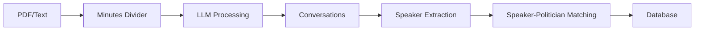
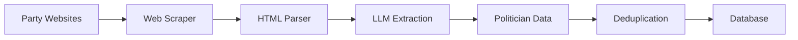
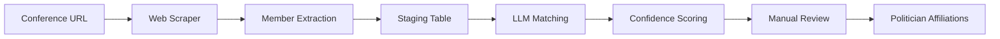
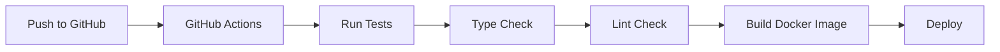

# Polibase アーキテクチャ概要

## 目次
- [システム概要](#システム概要)
- [技術スタック](#技術スタック)
- [アーキテクチャ概要](#アーキテクチャ概要)
- [データフロー](#データフロー)
- [コンポーネント構成](#コンポーネント構成)
- [デプロイメント](#デプロイメント)

## システム概要

Polibaseは、日本の政治活動を追跡・分析するアプリケーションです。政治家の発言、会議議事録、政治公約、投票記録などを管理し、データ分析を行います。

### 主要機能
- **議事録処理**: PDFやテキストから発言を抽出・構造化
- **政治家情報管理**: 政党ウェブサイトから政治家情報を収集
- **発言者マッチング**: LLMを使用した高精度な発言者-政治家マッチング
- **議員団管理**: 会派の構成とメンバーシップの追跡
- **データ可視化**: StreamlitによるWeb UI、日本地図可視化

## 技術スタック

### コア技術
- **言語**: Python 3.11+
- **フレームワーク**:
  - FastAPI (API開発予定)
  - Streamlit (Web UI)
  - LangChain/LangGraph (LLM統合)
- **データベース**: PostgreSQL 15
- **ORM**: SQLAlchemy 2.0

### AI/ML
- **LLM**: Google Gemini API (gemini-2.0-flash, gemini-1.5-flash)
- **State Management**: LangGraph

### インフラストラクチャ
- **コンテナ**: Docker, Docker Compose
- **ストレージ**: Google Cloud Storage
- **パッケージ管理**: UV (現代的なPythonパッケージマネージャー)

### 開発ツール
- **コードフォーマッター**: Ruff
- **型チェック**: Pyright
- **テスト**: pytest, pytest-asyncio
- **CI/CD**: GitHub Actions
- **Pre-commit**: pre-commit hooks

### 外部ライブラリ
- **Web Scraping**: Playwright, BeautifulSoup4
- **PDF処理**: pypdfium2
- **データ可視化**: Plotly, Folium
- **非同期処理**: asyncio, httpx

## アーキテクチャ概要

Polibaseは、保守性とテスト容易性を向上させるため、Clean Architectureを採用しています。

```
┌─────────────────────────────────────────────────────────┐
│                      Interfaces層                        │
│  ┌──────────┐  ┌────────────┐  ┌──────────────────┐   │
│  │   CLI    │  │ Streamlit  │  │  API (Future)    │   │
│  └──────────┘  └────────────┘  └──────────────────┘   │
└─────────────────────────────────────────────────────────┘
                           ▲
                           │
┌─────────────────────────────────────────────────────────┐
│                    Application層                         │
│  ┌──────────────────────────────────────────────────┐  │
│  │               Use Cases                          │  │
│  │  - ProcessMinutesUseCase                         │  │
│  │  - MatchSpeakersUseCase                          │  │
│  │  - ManageConferenceMembersUseCase                │  │
│  └──────────────────────────────────────────────────┘  │
│  ┌──────────────────────────────────────────────────┐  │
│  │               DTOs                               │  │
│  └──────────────────────────────────────────────────┘  │
└─────────────────────────────────────────────────────────┘
                           ▲
                           │
┌─────────────────────────────────────────────────────────┐
│                      Domain層                            │
│  ┌──────────────────────────────────────────────────┐  │
│  │               Entities                           │  │
│  │  - Meeting, Politician, Speaker, Conference      │  │
│  │  - GoverningBody, PoliticalParty, Proposal       │  │
│  └──────────────────────────────────────────────────┘  │
│  ┌──────────────────────────────────────────────────┐  │
│  │          Repository Interfaces                   │  │
│  └──────────────────────────────────────────────────┘  │
│  ┌──────────────────────────────────────────────────┐  │
│  │          Domain Services                         │  │
│  │  - SpeakerDomainService                          │  │
│  │  - PoliticianDomainService                       │  │
│  │  - MinutesDomainService                          │  │
│  └──────────────────────────────────────────────────┘  │
└─────────────────────────────────────────────────────────┘
                           ▲
                           │
┌─────────────────────────────────────────────────────────┐
│                   Infrastructure層                       │
│  ┌──────────────────────────────────────────────────┐  │
│  │           Repository Implementations              │  │
│  └──────────────────────────────────────────────────┘  │
│  ┌──────────────────────────────────────────────────┐  │
│  │           External Services                       │  │
│  │  - GeminiLLMService                               │  │
│  │  - GCSStorageService                              │  │
│  │  - PlaywrightScraperService                       │  │
│  └──────────────────────────────────────────────────┘  │
└─────────────────────────────────────────────────────────┘
```

### 層の責務

#### Domain層
- **責務**: ビジネスルールとビジネスロジックの実装
- **依存**: なし（最も内側の層）
- **主要コンポーネント**:
  - Entities: ビジネスオブジェクトとそのルール
  - Repository Interfaces: データアクセスの抽象化
  - Domain Services: エンティティに属さないビジネスロジック

#### Application層
- **責務**: アプリケーション固有のビジネスルール
- **依存**: Domain層
- **主要コンポーネント**:
  - Use Cases: ユーザーストーリーの実装
  - DTOs: 層間のデータ転送オブジェクト

#### Infrastructure層
- **責務**: 外部システムとの統合
- **依存**: Domain層、Application層
- **主要コンポーネント**:
  - Repository実装: SQLAlchemyによるデータアクセス
  - 外部サービス: LLM、ストレージ、Webスクレイピング

#### Interfaces層
- **責務**: ユーザーインターフェース
- **依存**: Application層
- **主要コンポーネント**:
  - CLI: コマンドラインインターフェース
  - Web UI: Streamlitアプリケーション
  - API: RESTful API（将来実装）

## データフロー

### 1. 議事録処理フロー



### 2. 政治家情報収集フロー



### 3. 会議メンバー抽出フロー



## コンポーネント構成

### コアコンポーネント

#### 議事録処理システム
- **MinutesDivider**: LangGraphによる状態管理を使用したPDF処理
- **ConversationExtractor**: 発言の抽出と構造化
- **SpeakerMatcher**: ハイブリッド（ルールベース+LLM）マッチング

#### データ収集システム
- **WebScraper**: Playwrightによる動的サイトスクレイピング
- **PartyMemberExtractor**: 政党メンバー情報の抽出
- **ConferenceMemberExtractor**: 会議メンバーの段階的抽出

#### データ管理システム
- **Repository Pattern**: データアクセスの抽象化
- **Domain Services**: ビジネスロジックの実装
- **Use Cases**: ワークフローのオーケストレーション

### サポートコンポーネント

#### モニタリング・可視化
- **Streamlit Dashboard**: インタラクティブなWeb UI
- **Plotly Charts**: データ可視化
- **Folium Maps**: 日本地図上でのデータ表示

#### 品質保証
- **Ruff**: コードフォーマットとリンティング
- **Pyright**: 静的型チェック
- **pytest**: 単体テストと統合テスト

## デプロイメント

### Docker構成

```yaml
services:
  sagebase:
    # アプリケーションコンテナ
    - Python 3.11
    - UV for package management
    - Chromium for web scraping

  postgres:
    # データベースコンテナ
    - PostgreSQL 15
    - Persistent volume for data

  # 将来追加予定
  redis:
    # キャッシュとジョブキュー

  nginx:
    # リバースプロキシ
```

### 環境設定

#### 必須環境変数
- `GOOGLE_API_KEY`: Gemini API アクセス
- `DATABASE_URL`: PostgreSQL接続
- `GCS_BUCKET_NAME`: Google Cloud Storage（オプション）

#### ポート構成
- **8501**: Streamlit UI（デフォルト）
- **8502**: モニタリングダッシュボード
- **5432**: PostgreSQL
- **8000**: API（将来実装）

注: git worktreeを使用する場合、`docker-compose.override.yml`でポートが自動的に変更されます。

### CI/CDパイプライン



## セキュリティ考慮事項

### 認証・認可
- API認証（将来実装）
- ロールベースアクセス制御（RBAC）

### データ保護
- 環境変数による機密情報管理
- SQLインジェクション対策（SQLAlchemy ORM）
- XSS対策（Streamlitの自動エスケープ）

### 監査ログ
- LLM処理履歴の記録
- プロンプトバージョン管理
- ユーザーアクション追跡

## パフォーマンス最適化

### データベース
- インデックス設計
- クエリ最適化
- コネクションプーリング

### 非同期処理
- async/awaitパターン
- バックグラウンドジョブ
- 並列処理

### キャッシング
- LLMレスポンスキャッシュ
- クエリ結果キャッシュ
- 静的コンテンツキャッシュ

## 関連ドキュメント

- [Clean Architecture詳細](./clean-architecture.md)
- [データベース設計](./database-design.md)
- [API仕様](../api/README.md)
- [開発ガイド](../guides/development.md)
- [デプロイメントガイド](../guides/deployment.md)
