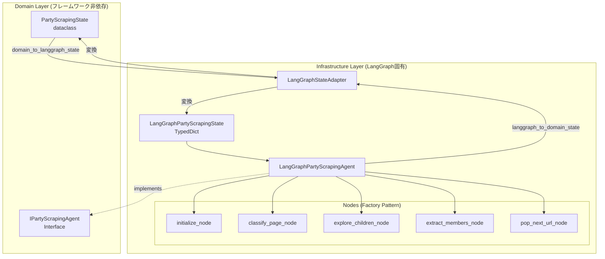
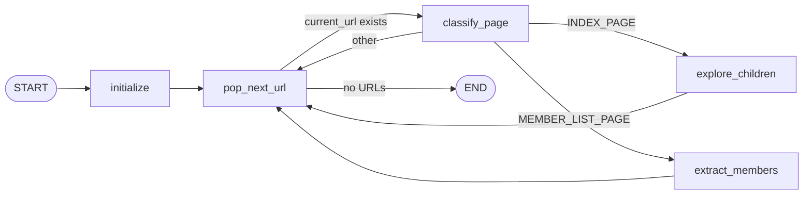
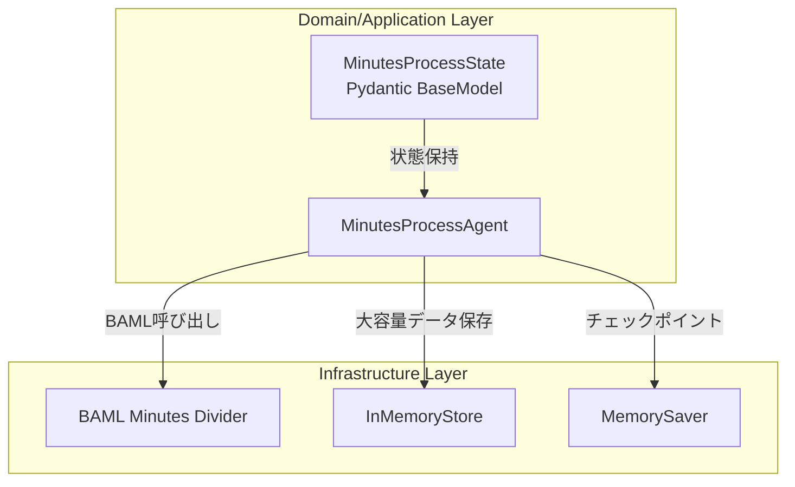
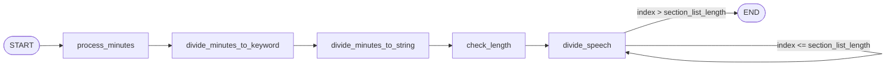
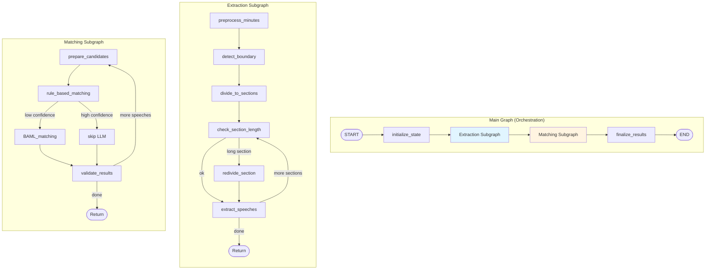
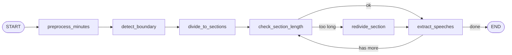
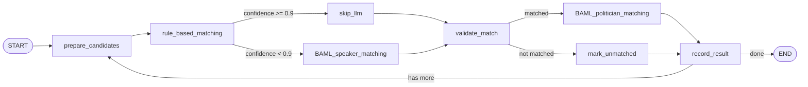
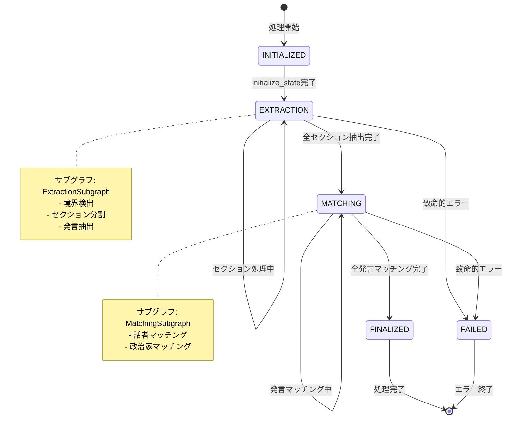

# LangGraphサブグラフアーキテクチャ設計

## 1. 現行アーキテクチャの概要

### 1.1 PartyScrapingAgent の構造

PartyScrapingAgentは、政党のWebサイトから階層的に議員情報をスクレイピングするLangGraphエージェントです。

#### アーキテクチャパターン



#### グラフフロー（拡張版）



#### 主要な特徴

1. **ドメイン/インフラ分離**: Clean Architecture準拠
2. **状態変換アダプター**: フレームワーク依存性を隠蔽
3. **ノードファクトリパターン**: 依存性注入可能
4. **グレースフル劣化**: エラー時も処理継続

### 1.2 MinutesProcessAgent の構造

MinutesProcessAgentは、議事録を分割・処理するLangGraphエージェントです。

#### アーキテクチャパターン



#### グラフフロー



#### 主要な特徴

1. **Pydantic状態管理**: `Annotated[list[...], operator.add]`で累積的更新
2. **メモリストア活用**: 大きなデータ（議事録テキスト等）を外部保存
3. **チェックポインティング**: 処理の中断・再開が可能
4. **線形フロー**: 条件付きループあり

---

## 2. サブグラフアーキテクチャの設計

### 2.1 全体構成図



### 2.2 メイングラフ（オーケストレーション）

メイングラフは、発言抽出と名寄せの全体フローを管理します。

#### 役割

1. **全体状態の管理**: 処理進捗、エラー状態、メトリクス収集
2. **サブグラフの呼び出し**: 発言抽出サブグラフ → 名寄せサブグラフの順序制御
3. **エラーハンドリング**: サブグラフからのエラーをキャッチし、適切に処理
4. **結果の集約**: 各サブグラフの結果を統合

#### ParentState 設計（詳細は3.1参照）

```python
@dataclass
class MinutesProcessingParentState:
    """メイングラフの状態"""
    # 入力データ
    minutes_id: int
    original_minutes: str
    conference_id: int

    # 処理進捗
    current_phase: ProcessingPhase  # EXTRACTION, MATCHING, FINALIZED
    extraction_completed: bool
    matching_completed: bool

    # サブグラフ結果
    extracted_speeches: list[SpeechData] = field(default_factory=list)
    matched_speakers: list[MatchedSpeaker] = field(default_factory=list)

    # エラー管理
    errors: list[ProcessingError] = field(default_factory=list)

    # メトリクス
    metrics: ProcessingMetrics = field(default_factory=ProcessingMetrics)
```

### 2.3 発言抽出サブグラフ

発言抽出サブグラフは、議事録テキストから発言を抽出します。

#### ノード構成



#### AgentState 設計（詳細は3.2参照）

```python
class ExtractionAgentState(TypedDict):
    """発言抽出サブグラフの状態"""
    # 入力
    original_minutes: str
    conference_id: int

    # 処理中データ
    preprocessed_minutes: str
    boundary_info: MinutesBoundary | None
    sections: list[SectionInfo]
    current_section_index: int

    # 出力
    speeches: Annotated[list[SpeechData], operator.add]

    # エラー管理
    error_message: str | None
```

#### 主要な改善点

1. **境界検出の堅牢化**: BAML呼び出しにリトライポリシー適用
2. **エラーハンドリング**: 例外スローに統一（空リスト返却を廃止）
3. **メトリクス収集**: 境界検出成功率、処理時間等を記録

### 2.4 名寄せサブグラフ

名寄せサブグラフは、抽出された発言の話者を特定します。

#### ノード構成



#### AgentState 設計（詳細は3.2参照）

```python
class MatchingAgentState(TypedDict):
    """名寄せサブグラフの状態"""
    # 入力
    speeches: list[SpeechData]
    conference_id: int

    # 処理中データ
    current_speech_index: int
    available_speakers: list[SpeakerCandidate]
    available_politicians: list[PoliticianCandidate]

    # 出力
    matched_results: Annotated[list[MatchedSpeaker], operator.add]

    # エラー管理
    error_message: str | None

    # メトリクス
    llm_calls: int
    rule_based_matches: int
```

#### 主要な改善点

1. **ハイブリッドアプローチの最適化**: ルールベースの信頼度閾値を0.9に統一
2. **リトライロジック適用**: BAML呼び出しに`RetryPolicy.external_service()`を適用
3. **メトリクス収集**: LLM呼び出し回数、マッチング成功率等を記録

---

## 3. 状態管理設計

### 3.1 ParentState の設計

ParentStateは、メイングラフの状態を管理します。フレームワーク非依存のドメイン層に定義します。

#### データ構造

```python
from dataclasses import dataclass, field
from enum import Enum
from datetime import datetime

class ProcessingPhase(str, Enum):
    """処理フェーズ"""
    INITIALIZED = "initialized"
    EXTRACTION = "extraction"
    MATCHING = "matching"
    FINALIZED = "finalized"
    FAILED = "failed"

@dataclass
class ProcessingError:
    """処理エラー情報"""
    phase: ProcessingPhase
    error_type: str
    error_message: str
    timestamp: datetime
    traceback: str | None = None

@dataclass
class ProcessingMetrics:
    """処理メトリクス"""
    # タイミング
    start_time: datetime | None = None
    end_time: datetime | None = None

    # 発言抽出
    boundary_detection_success: bool | None = None
    sections_extracted: int = 0
    speeches_extracted: int = 0

    # 名寄せ
    speaker_matches: int = 0
    politician_matches: int = 0
    llm_calls_total: int = 0
    rule_based_matches: int = 0

@dataclass
class MinutesProcessingParentState:
    """
    メイングラフの状態（ドメイン層）

    フレームワーク非依存のドメインモデルとして定義し、
    LangGraph固有のTypedDictへの変換はインフラ層のアダプターで行う。
    """
    # ===== 入力データ =====
    minutes_id: int
    original_minutes: str
    conference_id: int

    # ===== 処理進捗 =====
    current_phase: ProcessingPhase = ProcessingPhase.INITIALIZED
    extraction_completed: bool = False
    matching_completed: bool = False

    # ===== サブグラフ結果 =====
    extracted_speeches: list[dict] = field(default_factory=list)
    matched_speakers: list[dict] = field(default_factory=list)

    # ===== エラー管理 =====
    errors: list[ProcessingError] = field(default_factory=list)
    has_fatal_error: bool = False

    # ===== メトリクス =====
    metrics: ProcessingMetrics = field(default_factory=ProcessingMetrics)

    def add_error(self, phase: ProcessingPhase, error_type: str,
                  error_message: str, traceback: str | None = None) -> None:
        """エラーを追加"""
        self.errors.append(ProcessingError(
            phase=phase,
            error_type=error_type,
            error_message=error_message,
            timestamp=datetime.now(),
            traceback=traceback,
        ))

    def mark_phase_completed(self, phase: ProcessingPhase) -> None:
        """フェーズ完了をマーク"""
        if phase == ProcessingPhase.EXTRACTION:
            self.extraction_completed = True
            self.current_phase = ProcessingPhase.MATCHING
        elif phase == ProcessingPhase.MATCHING:
            self.matching_completed = True
            self.current_phase = ProcessingPhase.FINALIZED

    @property
    def is_completed(self) -> bool:
        """処理完了判定"""
        return self.extraction_completed and self.matching_completed
```

#### 設計原則

1. **不変性の保護**: プロパティは読み取り専用、変更は専用メソッド経由
2. **フレームワーク非依存**: LangGraphへの依存を排除
3. **エラーファースト**: エラー情報を明示的に管理
4. **メトリクス収集**: 品質改善のための計測ポイントを組み込み

### 3.2 AgentState の設計

各サブグラフは独自のAgentStateを持ちます。LangGraph固有のTypedDictとして定義します。

#### 発言抽出サブグラフのAgentState

```python
from typing import TypedDict, Annotated
import operator

class ExtractionAgentState(TypedDict):
    """
    発言抽出サブグラフの状態（インフラ層）

    LangGraph固有のTypedDictとして定義。
    """
    # ===== 入力 =====
    original_minutes: str
    conference_id: int

    # ===== 処理中データ =====
    preprocessed_minutes: str
    boundary_info: dict | None  # MinutesBoundaryをdict化
    sections: list[dict]  # SectionInfoをdict化
    current_section_index: int

    # ===== 出力（累積） =====
    speeches: Annotated[list[dict], operator.add]

    # ===== エラー管理 =====
    error_message: str | None

    # ===== メトリクス =====
    boundary_detection_attempts: int
    llm_calls: int
```

#### 名寄せサブグラフのAgentState

```python
class MatchingAgentState(TypedDict):
    """
    名寄せサブグラフの状態（インフラ層）

    LangGraph固有のTypedDictとして定義。
    """
    # ===== 入力 =====
    speeches: list[dict]
    conference_id: int

    # ===== 処理中データ =====
    current_speech_index: int
    available_speakers: list[dict]
    available_politicians: list[dict]

    # ===== 出力（累積） =====
    matched_results: Annotated[list[dict], operator.add]

    # ===== エラー管理 =====
    error_message: str | None

    # ===== メトリクス =====
    llm_calls: int
    rule_based_matches: int
    baml_speaker_matches: int
    baml_politician_matches: int
```

### 3.3 状態遷移図



### 3.4 ドメイン層とインフラ層の分離パターン

PartyScrapingAgentと同様に、状態変換アダプターを使用します。

```python
# infrastructure/external/langgraph_state_adapter.py

def parent_state_to_langgraph(
    domain_state: MinutesProcessingParentState
) -> dict:
    """ドメイン状態をLangGraph状態に変換"""
    return {
        "minutes_id": domain_state.minutes_id,
        "original_minutes": domain_state.original_minutes,
        "conference_id": domain_state.conference_id,
        "current_phase": domain_state.current_phase.value,
        "extraction_completed": domain_state.extraction_completed,
        "matching_completed": domain_state.matching_completed,
        "extracted_speeches": domain_state.extracted_speeches,
        "matched_speakers": domain_state.matched_speakers,
        "errors": [asdict(e) for e in domain_state.errors],
        "has_fatal_error": domain_state.has_fatal_error,
        "metrics": asdict(domain_state.metrics),
    }

def langgraph_to_parent_state(
    lg_state: dict
) -> MinutesProcessingParentState:
    """LangGraph状態をドメイン状態に変換"""
    return MinutesProcessingParentState(
        minutes_id=lg_state["minutes_id"],
        original_minutes=lg_state["original_minutes"],
        conference_id=lg_state["conference_id"],
        current_phase=ProcessingPhase(lg_state["current_phase"]),
        extraction_completed=lg_state["extraction_completed"],
        matching_completed=lg_state["matching_completed"],
        extracted_speeches=lg_state["extracted_speeches"],
        matched_speakers=lg_state["matched_speakers"],
        errors=[ProcessingError(**e) for e in lg_state["errors"]],
        has_fatal_error=lg_state["has_fatal_error"],
        metrics=ProcessingMetrics(**lg_state["metrics"]),
    )
```

---

## 4. 成功指標（KPI）

### 4.1 処理品質KPI

| 指標 | 定義 | 目標値 | 測定方法 | 優先度 |
|------|------|-------|---------|-------|
| 発言抽出成功率 | 空でない発言リストが返される割合 | 98%以上 | `len(speeches) > 0`の件数 / 総処理件数 | P0 |
| 境界検出精度 | `boundary_found=True`の割合 | 95%以上 | `boundary_found`がTrueの件数 / 総処理件数 | P0 |
| 話者マッチング精度 | 話者マッチング成功率 | 90%以上 | `matched=True`の件数 / 総発言数 | P0 |
| 政治家マッチング精度 | 政治家マッチング成功率 | 85%以上 | `matched=True`の件数 / 総話者数 | P1 |
| 再分割発生率 | 長すぎるセクションの再分割が必要な割合 | 10%未満 | 再分割されたセクション数 / 総セクション数 | P2 |

### 4.2 パフォーマンスKPI

| 指標 | 定義 | 目標値 | 測定方法 | 優先度 |
|------|------|-------|---------|-------|
| 処理時間（議事録1件） | 発言抽出から名寄せ完了までの時間 | 60秒以内 | `end_time - start_time` | P1 |
| LLM呼び出し回数 | 議事録1件あたりのLLM呼び出し回数 | 50回以内 | `metrics.llm_calls_total` | P1 |
| ルールベース適用率 | ルールベースマッチングでLLMをスキップした割合 | 60%以上 | `rule_based_matches / total_matches` | P1 |
| LLM呼び出し削減率 | ハイブリッドアプローチによる削減率 | 50%以上 | 1 - (実際のLLM呼び出し / 全件LLM呼び出し) | P2 |

### 4.3 信頼性KPI

| 指標 | 定義 | 目標値 | 測定方法 | 優先度 |
|------|------|-------|---------|-------|
| 処理エラー率 | 致命的エラーで処理が失敗した割合 | 1%未満 | `has_fatal_error=True`の件数 / 総処理件数 | P0 |
| LLMリトライ発生率 | リトライが発生した処理の割合 | 5%未満 | リトライが発生した件数 / 総LLM呼び出し | P1 |
| リトライ成功率 | リトライによって成功した処理の割合 | 90%以上 | リトライ成功件数 / リトライ発生件数 | P1 |
| データ整合性エラー率 | 連番不整合等のデータ整合性エラー | 0.5%未満 | 整合性エラー件数 / 総処理件数 | P2 |

### 4.4 KPI測定の実装

```python
# infrastructure/monitoring/langgraph_metrics.py

class LangGraphMetricsCollector:
    """LangGraphエージェントのメトリクス収集"""

    def __init__(self, performance_monitor: PerformanceMonitor):
        self.performance_monitor = performance_monitor

    def record_extraction_metrics(self, state: MinutesProcessingParentState) -> None:
        """発言抽出のメトリクスを記録"""
        metrics = state.metrics

        # 処理品質KPI
        self.performance_monitor.record_metric(
            "extraction.boundary_detection_success",
            1 if metrics.boundary_detection_success else 0
        )
        self.performance_monitor.record_metric(
            "extraction.sections_extracted",
            metrics.sections_extracted
        )
        self.performance_monitor.record_metric(
            "extraction.speeches_extracted",
            metrics.speeches_extracted
        )

        # パフォーマンスKPI
        if metrics.start_time and metrics.end_time:
            duration = (metrics.end_time - metrics.start_time).total_seconds()
            self.performance_monitor.record_metric(
                "extraction.processing_time_seconds",
                duration
            )

    def record_matching_metrics(self, state: MinutesProcessingParentState) -> None:
        """名寄せのメトリクスを記録"""
        metrics = state.metrics

        # 処理品質KPI
        self.performance_monitor.record_metric(
            "matching.speaker_matches",
            metrics.speaker_matches
        )
        self.performance_monitor.record_metric(
            "matching.politician_matches",
            metrics.politician_matches
        )

        # パフォーマンスKPI
        self.performance_monitor.record_metric(
            "matching.llm_calls_total",
            metrics.llm_calls_total
        )
        self.performance_monitor.record_metric(
            "matching.rule_based_matches",
            metrics.rule_based_matches
        )

        # ルールベース適用率
        total_matches = metrics.speaker_matches + metrics.politician_matches
        if total_matches > 0:
            rule_based_ratio = metrics.rule_based_matches / total_matches
            self.performance_monitor.record_metric(
                "matching.rule_based_ratio",
                rule_based_ratio
            )
```

---

## 5. 既存実装からのベストプラクティス適用

### 5.1 ドメイン/インフラ分離パターンの適用

PartyScrapingAgentで実証されたパターンを、議事録処理にも適用します。

| パターン | 既存実装 | 新規適用 |
|---------|---------|---------|
| ドメイン状態 | `PartyScrapingState` (dataclass) | `MinutesProcessingParentState` (dataclass) |
| LangGraph状態 | `LangGraphPartyScrapingState` (TypedDict) | `ExtractionAgentState`, `MatchingAgentState` (TypedDict) |
| 状態変換 | `domain_to_langgraph_state()` | `parent_state_to_langgraph()` |
| インターフェース | `IPartyScrapingAgent` | `IMinutesProcessingAgent` |

**利点**:
- フレームワーク変更に強い
- テスト容易性の向上
- ドメインロジックの再利用性

### 5.2 ノードファクトリパターンの適用

依存性注入を可能にするノードファクトリパターンを適用します。

```python
# infrastructure/external/langgraph_nodes/extraction_nodes.py

def create_detect_boundary_node(
    minutes_divider: IMinutesDividerService,
    metrics_collector: LangGraphMetricsCollector,
) -> Callable[[ExtractionAgentState], Awaitable[ExtractionAgentState]]:
    """境界検出ノードを生成"""

    @with_retry(policy=RetryPolicy.external_service())
    async def detect_boundary_node(
        state: ExtractionAgentState
    ) -> ExtractionAgentState:
        """境界検出を実行"""
        try:
            boundary = await minutes_divider.detect_attendee_boundary(
                state["preprocessed_minutes"]
            )

            state["boundary_info"] = {
                "boundary_found": boundary.boundary_found,
                "boundary_text": boundary.boundary_text,
                "boundary_type": boundary.boundary_type,
                "confidence": boundary.confidence,
            }

            # メトリクス記録
            metrics_collector.record_boundary_detection(boundary.boundary_found)

            return state
        except Exception as e:
            logger.error(f"Boundary detection failed: {e}", exc_info=True)
            raise ExternalServiceException(
                service_name="BAML",
                operation="detect_boundary",
                reason=str(e),
            ) from e

    return detect_boundary_node
```

**利点**:
- 依存性注入でテスト容易
- リトライポリシーの一元管理
- エラーハンドリングの統一

### 5.3 グレースフル劣化の選択的適用

PartyScrapingAgentのグレースフル劣化パターンを参考に、エラー時の戦略を定義します。

| エラー種別 | 戦略 | 理由 |
|-----------|------|------|
| 境界検出失敗 | **例外スロー** | データ品質への影響が大きい |
| セクション分割失敗 | **例外スロー** | 発言抽出の前提条件 |
| 発言抽出失敗 | **グレースフル劣化** | 一部セクションの失敗を許容 |
| 話者マッチング失敗 | **グレースフル劣化** | 未マッチとして記録 |
| 政治家マッチング失敗 | **グレースフル劣化** | 未マッチとして記録 |

**実装例**:

```python
async def extract_speeches_node(state: ExtractionAgentState) -> ExtractionAgentState:
    """発言抽出（グレースフル劣化）"""
    speeches = []

    for section in state["sections"]:
        try:
            section_speeches = await minutes_divider.divide_speech(section)
            speeches.extend(section_speeches)
        except Exception as e:
            # セクション単位の失敗は許容
            logger.warning(f"Speech extraction failed for section: {e}")
            state["error_message"] = f"Partial failure: {e}"
            # 処理は継続

    state["speeches"] = speeches
    return state
```

### 5.4 不変性保護パターンの適用

PartyScrapingStateと同様に、不変性を保護します。

```python
@dataclass
class MinutesProcessingParentState:
    # ...

    _extracted_speeches: list[dict] = field(default_factory=list)

    @property
    def extracted_speeches(self) -> tuple[dict, ...]:
        """抽出済み発言（読み取り専用）"""
        return tuple(self._extracted_speeches)

    def add_speech(self, speech: dict) -> None:
        """発言を追加"""
        self._extracted_speeches.append(speech)

    def add_speeches(self, speeches: list[dict]) -> None:
        """複数の発言を追加"""
        self._extracted_speeches.extend(speeches)
```

---

## 6. 実装ロードマップ

### Phase 1: 基盤整備（PBI-002）

1. ParentState、AgentState の定義
2. 状態変換アダプターの実装
3. メトリクス収集機構の実装

### Phase 2: 発言抽出サブグラフ（PBI-003）

1. ノードファクトリの実装
2. リトライポリシーの適用
3. エラーハンドリングの統一

### Phase 3: 名寄せサブグラフ（PBI-004）

1. ノードファクトリの実装
2. ハイブリッドアプローチの最適化
3. 信頼度閾値の統一

### Phase 4: 統合とテスト（PBI-005）

1. メイングラフの実装
2. 統合テストの作成
3. KPIダッシュボードの作成

---

## 7. 参考資料

- 既存実装: `src/infrastructure/external/langgraph_party_scraping_agent_with_classification.py`
- 状態管理: `src/domain/entities/party_scraping_state.py`
- 状態変換: `src/infrastructure/external/langgraph_state_adapter.py`
- ノードファクトリ: `src/infrastructure/external/langgraph_nodes/*.py`
- 現状分析: `docs/analysis/extraction_matching_issues.md`
