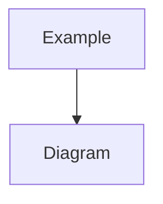

# Polibase Architecture Diagrams

This directory contains Mermaid diagram sources for visualizing Polibase's Clean Architecture.

## Diagram Index

### Core Architecture

#### 1. [Layer Dependency Diagram](layer-dependency.mmd)
**Purpose**: Shows the four layers of Clean Architecture and their dependencies

**What you'll learn**:
- How layers are organized (Interfaces → Application → Domain ← Infrastructure)
- The dependency rule (dependencies point inward toward Domain)
- Which components belong to each layer

**When to use**:
- Understanding overall system structure
- Explaining architecture to new team members
- Verifying dependency directions when adding new features

#### 2. [Component Interaction Diagram](component-interaction.mmd)
**Purpose**: Shows how components interact across layers in a typical request

**What you'll learn**:
- End-to-end flow from User to Database
- Role of each component (Presenter, UseCase, DomainService, Repository)
- How DTOs prevent domain model leakage
- Dependency Inversion in action

**When to use**:
- Understanding request/response flow
- Planning new features
- Debugging issues across layers

### Data Flow Diagrams

#### 3. [Minutes Processing Flow](data-flow-minutes-processing.mmd)
**Purpose**: Sequence diagram showing how meeting minutes are processed

**What you'll learn**:
- Complete workflow from PDF to database
- LLM integration for speech extraction
- Error handling and transaction management
- GCS (Google Cloud Storage) integration

**Key steps**:
1. Fetch meeting data from database
2. Download text from GCS
3. LLM divides text into speeches
4. Domain validation creates entities
5. Batch save to database

#### 4. [Politician Scraping Flow](data-flow-politician-scraping.mmd)
**Purpose**: Three-stage process for scraping politician data from party websites

**What you'll learn**:
- Web scraping with Playwright
- LLM-based data extraction from HTML
- Staging table pattern for quality control
- Manual review workflow

**Stages**:
1. **Scraping**: Fetch and extract politician data
2. **Staging**: Save to `extracted_politicians` for review
3. **Conversion**: Manual approval converts to `politicians` table

### Patterns & Best Practices

#### 5. [Repository Pattern Diagram](repository-pattern.mmd)
**Purpose**: Detailed view of repository pattern implementation

**What you'll learn**:
- Generic `BaseRepository[T]` pattern
- `ISessionAdapter` abstraction
- Async/await support
- Dependency Inversion Principle in practice

**Key components**:
- Domain: Interfaces (`IMeetingRepository`, `ISessionAdapter`)
- Infrastructure: Implementations (`MeetingRepositoryImpl`, `AsyncSessionAdapter`)
- Session management and transaction handling

## Viewing the Diagrams

### In GitHub
All Mermaid diagrams render automatically in GitHub's markdown preview. Just click on any `.mmd` file to view it.

### In VS Code
Install the [Mermaid Preview extension](https://marketplace.visualstudio.com/items?itemName=bierner.markdown-mermaid) to view diagrams inline.

### Online
Use [Mermaid Live Editor](https://mermaid.live/) to view and edit diagrams:
1. Copy the content of any `.mmd` file
2. Paste into the editor
3. See real-time preview

## Diagram Format

All diagrams use [Mermaid.js](https://mermaid.js.org/) syntax:



Benefits:
- ✅ Renders in GitHub markdown
- ✅ Version controlled (text-based)
- ✅ Easy to maintain
- ✅ No external tools needed

## Updating Diagrams

To update a diagram:

1. Edit the `.mmd` file directly
2. Test rendering in GitHub or Mermaid Live Editor
3. Update the explanation text if needed
4. Commit changes

## Related Documentation

- [docs/ARCHITECTURE.md](../ARCHITECTURE.md) - Comprehensive architecture guide
- [docs/CLEAN_ARCHITECTURE_MIGRATION.md](../CLEAN_ARCHITECTURE_MIGRATION.md) - Migration guide
- [README.md](../../README.md) - Project overview
- [CLAUDE.md](../../CLAUDE.md) - Developer guide

## Quick Reference

### When to use which diagram?

| Situation | Recommended Diagram |
|-----------|---------------------|
| New team member onboarding | Layer Dependency → Component Interaction |
| Planning a new feature | Layer Dependency → relevant Data Flow |
| Understanding existing workflow | Specific Data Flow diagram |
| Repository implementation | Repository Pattern |
| Architecture review | Layer Dependency + Component Interaction |
| Debugging data flow issues | Relevant Data Flow + Component Interaction |

### Diagram Relationships

```
Layer Dependency (high-level)
    ├─ Component Interaction (mid-level detail)
    │   ├─ Minutes Processing Flow (specific workflow)
    │   └─ Politician Scraping Flow (specific workflow)
    └─ Repository Pattern (implementation detail)
```

## Contributing

When adding new diagrams:

1. Use consistent naming: `[category]-[description].mmd`
2. Include explanation text after the diagram
3. Update this README.md index
4. Add cross-references to related docs
5. Follow existing style and color conventions

## Color Conventions

Our diagrams use consistent colors across all visualizations:

- **Interfaces Layer**: Light blue (`#e1f5ff`)
- **Application Layer**: Light orange (`#fff3e0`)
- **Domain Layer**: Light purple (`#f3e5f5`) - Most important, thicker border
- **Infrastructure Layer**: Light green (`#e8f5e9`)
- **External Services**: Light red (`#ffebee`)
- **Database**: Light blue (`#e3f2fd`)

This helps quickly identify which layer a component belongs to across different diagrams.
