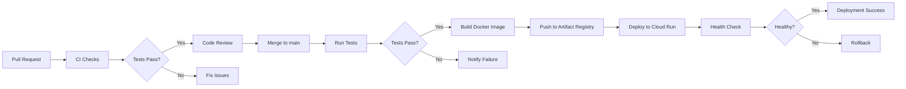

# CI/CD Pipeline Documentation

このドキュメントは、SagebaseプロジェクトのCI/CDパイプラインについて説明します。

## 目次

- [概要](#概要)
- [パイプライン構成](#パイプライン構成)
- [ワークフロー詳細](#ワークフロー詳細)
- [GitHub Secretsの設定](#github-secretsの設定)
- [デプロイフロー](#デプロイフロー)
- [ロールバック手順](#ロールバック手順)
- [トラブルシューティング](#トラブルシューティング)
- [ベストプラクティス](#ベストプラクティス)

---

## 概要

Sagebaseでは、GitHub ActionsとGoogle Cloud Runを使用した完全自動化されたCI/CDパイプラインを構築しています。

### パイプラインの目標

1. **品質保証**: すべてのコード変更に対して自動テストとリント
2. **自動デプロイ**: mainブランチへのマージで本番環境に自動デプロイ
3. **高速フィードバック**: PRごとのCI/CDチェック
4. **安全性**: デプロイ失敗時の迅速なロールバック
5. **可視性**: デプロイ状況の透明性とログ記録

### CI/CDフロー概要



---

## パイプライン構成

Sagebaseには以下のGitHub Actionsワークフローがあります：

### 1. CI Workflow (`.github/workflows/ci.yml`)

**トリガー**: すべてのPull Request

**目的**: 高速なコード品質チェック

**ステップ**:
- Python構文チェック
- 依存関係のインストール
- 基本的なインポートチェック
- Ruffフォーマットチェック
- Ruffリンター
- Banditセキュリティスキャン

**実行時間**: 約1-2分

### 2. Test Workflow (`.github/workflows/test.yml`)

**トリガー**: mainブランチへのpush、PRへのpush

**目的**: 包括的なテストとコード品質チェック

**ジョブ**:

#### test
- PostgreSQLサービスコンテナの起動
- pytest実行（カバレッジ測定）
- カバレッジレポートの生成とアップロード
- Codecovへのカバレッジ送信

#### code-quality
- Ruffフォーマットチェック
- Ruffリンター
- Pyright型チェック

#### security
- Banditセキュリティスキャン
- TruffleHog（シークレット検出）
- pip-audit（依存関係の脆弱性スキャン）

#### integration-test
- CLIコマンドのテスト
- Streamlitアプリの起動テスト
- データベース接続テスト

**実行時間**: 約10-15分

### 3. Deploy Workflow (`.github/workflows/deploy-to-cloud-run.yml`)

**トリガー**:
- mainブランチへのpush（自動）
- 手動トリガー（workflow_dispatch）

**目的**: Cloud Runへの自動デプロイ

**ステップ**:
1. テストワークフローの完了を待機
2. Google Cloud認証
3. Artifact Registryリポジトリの確認/作成
4. Dockerイメージのビルド
5. イメージのプッシュ
6. Cloud Runへのデプロイ
7. ヘルスチェック
8. デプロイサマリーの出力
9. （オプション）Slack通知

**実行時間**: 約5-10分

---

## ワークフロー詳細

### Deploy to Cloud Run ワークフロー

#### トリガー条件

```yaml
on:
  push:
    branches:
      - main
  workflow_dispatch:
    inputs:
      environment:
        description: 'デプロイ環境'
        required: true
        default: 'production'
```

- **自動**: mainブランチへのpushで自動実行
- **手動**: GitHub UIから手動でトリガー可能

#### 認証方式

2つの認証方式をサポート：

**1. Workload Identity Federation（推奨）**
- Service Account Keyを使用しない、よりセキュアな方式
- `USE_WORKLOAD_IDENTITY=true`で有効化
- 必要な設定:
  - `GCP_WORKLOAD_IDENTITY_PROVIDER`
  - `GCP_SERVICE_ACCOUNT`

**2. Service Account Key**
- 従来の認証方式
- `GCP_SA_KEY`（JSON形式）を使用

#### デプロイプロセス

1. **テスト完了待機**
   ```yaml
   - name: Wait for tests to complete
     uses: fountainhead/action-wait-for-check@v1.2.0
   ```
   - mainブランチへのpush時のみ
   - テストワークフローの成功を確認

2. **イメージビルド**
   - `Dockerfile.cloudrun`を使用
   - マルチステージビルドで最適化
   - SHA付きタグとlatestタグを作成

3. **Cloud Runデプロイ**
   - リソース: CPU 2コア、メモリ 2GB
   - スケーリング: 0-10インスタンス
   - タイムアウト: 300秒
   - Secret Manager統合
   - Cloud SQL接続（オプション）

4. **ヘルスチェック**
   - デプロイ後にサービスURLへのリクエスト
   - 最大5回リトライ

#### 環境変数とシークレット

デプロイ時に設定される環境変数：

| 環境変数 | 値 | 説明 |
|---------|-----|------|
| `CLOUD_RUN` | `true` | Cloud Run環境フラグ |
| `PORT` | `8080` | Streamlitポート |
| `HEALTH_CHECK_PORT` | `8081` | ヘルスチェックポート |
| `LOG_LEVEL` | `INFO` | ログレベル |
| `USE_VERTEX_AI` | `true` | Vertex AI使用フラグ |
| `GOOGLE_CLOUD_PROJECT` | プロジェクトID | Vertex AI用GCPプロジェクト |
| `VERTEX_AI_LOCATION` | リージョン | Vertex AIのロケーション |

Secret Managerから注入：
- `DB_PASSWORD`: データベースパスワード

**注意**: Vertex AI経由でGeminiを使用するため、API Keyは不要です。サービスアカウント認証を使用します。

---

## GitHub Secretsの設定

デプロイワークフローには以下のGitHub Secretsが必要です。

### 必須Secrets

| Secret名 | 説明 | 例 |
|---------|------|-----|
| `GCP_PROJECT_ID` | GCPプロジェクトID | `my-project-123456` |
| `GCP_SA_KEY` | サービスアカウントキー（JSON） | `{"type": "service_account", ...}` |

### オプションSecrets

| Secret名 | 説明 | デフォルト値 |
|---------|------|------------|
| `GCP_REGION` | デプロイリージョン | `asia-northeast1` |
| `GCP_SERVICE_NAME` | Cloud Runサービス名 | `sagebase-streamlit` |
| `GCP_ARTIFACT_REPOSITORY` | Artifact Registryリポジトリ名 | `sagebase` |
| `CLOUD_SQL_INSTANCE` | Cloud SQLインスタンス名 | - |
| `SLACK_WEBHOOK_URL` | Slack通知用WebhookURL | - |

### Workload Identity Federation使用時（推奨）

| Secret名 | 説明 |
|---------|------|
| `GCP_WORKLOAD_IDENTITY_PROVIDER` | Workload Identity ProviderのリソースID |
| `GCP_SERVICE_ACCOUNT` | サービスアカウントのメールアドレス |

### Variables（リポジトリ変数）

| Variable名 | 説明 | 値 |
|-----------|------|-----|
| `USE_WORKLOAD_IDENTITY` | Workload Identity使用フラグ | `true` / `false` |

### Secretsの設定方法

#### 1. GitHub UIから設定

1. リポジトリの **Settings** → **Secrets and variables** → **Actions**
2. **New repository secret** をクリック
3. Secret名と値を入力
4. **Add secret** で保存

#### 2. GitHub CLIから設定

```bash
# GCP Project ID
gh secret set GCP_PROJECT_ID --body "your-project-id"

# Service Account Key（ファイルから）
gh secret set GCP_SA_KEY < path/to/service-account-key.json

# Cloud SQL Instance
gh secret set CLOUD_SQL_INSTANCE --body "project:region:instance"

# Slack Webhook URL
gh secret set SLACK_WEBHOOK_URL --body "https://hooks.slack.com/services/..."
```

---

## デプロイフロー

### 通常のデプロイフロー

```bash
# 1. 開発ブランチで作業
git checkout -b feature/new-feature

# 2. コードの変更とコミット
git add .
git commit -m "feat: add new feature"

# 3. PRを作成
git push origin feature/new-feature
gh pr create --title "feat: add new feature" --body "..."

# 4. CIチェックが自動実行される
# - ci.yml: Quick Checks
# - test.yml: Tests & Security

# 5. レビューと承認

# 6. mainブランチにマージ
gh pr merge --squash

# 7. 自動デプロイが開始される
# - test.ymlが再実行される
# - deploy-to-cloud-run.ymlが実行される
# - Cloud Runにデプロイされる
```

### 手動デプロイ

GitHub UIから手動でデプロイをトリガーできます。

1. リポジトリの **Actions** タブを開く
2. **Deploy to Cloud Run** ワークフローを選択
3. **Run workflow** をクリック
4. 環境を選択（production / staging）
5. **Run workflow** で実行

### デプロイステータスの確認

#### GitHub Actions UI

- リポジトリの **Actions** タブでワークフローの実行状況を確認
- 各ステップの詳細ログを閲覧可能

#### Cloud Runコンソール

```bash
# サービスの状態確認
gcloud run services describe sagebase-streamlit \
  --region=asia-northeast1 \
  --project=YOUR_PROJECT_ID

# 最新のリビジョン確認
gcloud run revisions list \
  --service=sagebase-streamlit \
  --region=asia-northeast1 \
  --project=YOUR_PROJECT_ID \
  --limit=5

# ログの確認
gcloud run logs tail sagebase-streamlit \
  --region=asia-northeast1 \
  --project=YOUR_PROJECT_ID
```

---

## ロールバック手順

デプロイに問題が発生した場合、迅速にロールバックできます。

### 方法1: ロールバックスクリプト（推奨）

プロジェクトには専用のロールバックスクリプトが用意されています。

#### 直前のリビジョンにロールバック

```bash
export PROJECT_ID="your-project-id"
export REGION="asia-northeast1"
export SERVICE_NAME="sagebase-streamlit"

./scripts/rollback.sh --previous
```

#### 特定のリビジョンにロールバック

```bash
# リビジョン一覧を表示
./scripts/rollback.sh --list

# 特定のリビジョンにロールバック
./scripts/rollback.sh --revision sagebase-streamlit-00005-abc
```

#### トラフィック分割でロールバック

```bash
# 新旧50%ずつトラフィック分割
./scripts/rollback.sh --revision sagebase-streamlit-00005-abc --traffic 50
```

### 方法2: gcloudコマンド直接実行

```bash
# リビジョン一覧を確認
gcloud run revisions list \
  --service=sagebase-streamlit \
  --region=asia-northeast1 \
  --project=YOUR_PROJECT_ID

# 特定のリビジョンにロールバック
gcloud run services update-traffic sagebase-streamlit \
  --to-revisions=sagebase-streamlit-00005-abc=100 \
  --region=asia-northeast1 \
  --project=YOUR_PROJECT_ID
```

### 方法3: Cloud Runコンソール

1. [Cloud Runコンソール](https://console.cloud.google.com/run)を開く
2. サービス（sagebase-streamlit）を選択
3. **Revisions** タブを開く
4. ロールバックしたいリビジョンを選択
5. **Manage Traffic** で100%トラフィックを割り当て

### ロールバック後の確認

```bash
# サービスURLの取得
SERVICE_URL=$(gcloud run services describe sagebase-streamlit \
  --region=asia-northeast1 \
  --project=YOUR_PROJECT_ID \
  --format="value(status.url)")

# ヘルスチェック
curl $SERVICE_URL

# ログ監視
gcloud run logs tail sagebase-streamlit \
  --region=asia-northeast1 \
  --project=YOUR_PROJECT_ID
```

---

## トラブルシューティング

### デプロイが失敗する

#### 症状
GitHub Actionsのデプロイワークフローが失敗

#### 原因と解決方法

**1. 認証エラー**

```
Error: Failed to authenticate to Google Cloud
```

**解決方法**:
- `GCP_SA_KEY`または`GCP_WORKLOAD_IDENTITY_PROVIDER`が正しく設定されているか確認
- サービスアカウントに必要な権限があるか確認

```bash
# 必要な権限
# - Cloud Run Admin
# - Artifact Registry Writer
# - Service Account User
```

**2. イメージビルドエラー**

```
Error: Docker build failed
```

**解決方法**:
- `Dockerfile.cloudrun`の構文を確認
- 依存関係の問題を確認（`pyproject.toml`、`uv.lock`）

**3. デプロイタイムアウト**

```
Error: Deployment timeout
```

**解決方法**:
- Cloud Runのリソース制限を確認
- アプリケーションの起動時間を最適化
- タイムアウト設定を調整

### テストが失敗してデプロイされない

#### 症状
mainブランチにマージ後、テストが失敗してデプロイが開始されない

#### 解決方法

```bash
# ローカルでテストを実行
uv run pytest -xvs

# 問題を修正
git add .
git commit -m "fix: resolve test failures"
git push origin main

# または、ホットフィックスブランチを作成
git checkout -b hotfix/fix-tests
# ... 修正 ...
gh pr create --title "hotfix: fix tests"
```

### ロールバックが必要な場合

#### 症状
デプロイは成功したが、本番環境で問題が発生

#### 即座のロールバック

```bash
# 最速の方法
PROJECT_ID=your-project ./scripts/rollback.sh --previous

# または
gcloud run services update-traffic sagebase-streamlit \
  --to-latest \
  --region=asia-northeast1
```

### Vertex AI APIにアクセスできない

#### 症状
```
Error: Permission denied on Vertex AI API
```

#### 解決方法

```bash
# Vertex AI APIを有効化
gcloud services enable aiplatform.googleapis.com --project=YOUR_PROJECT_ID

# Cloud RunサービスアカウントにVertex AI権限を付与
PROJECT_NUMBER=$(gcloud projects describe YOUR_PROJECT_ID --format='value(projectNumber)')

gcloud projects add-iam-policy-binding YOUR_PROJECT_ID \
  --member="serviceAccount:${PROJECT_NUMBER}-compute@developer.gserviceaccount.com" \
  --role="roles/aiplatform.user"
```

### Secret Managerのシークレットが見つからない

#### 症状
```
Error: Secret 'database-password' not found
```

#### 解決方法

```bash
# データベースパスワードのシークレットを作成
echo -n "YOUR_DB_PASSWORD" | gcloud secrets create database-password \
  --data-file=- \
  --replication-policy=automatic \
  --project=YOUR_PROJECT_ID

# サービスアカウントにアクセス権限を付与
gcloud secrets add-iam-policy-binding database-password \
  --member="serviceAccount:SERVICE_ACCOUNT_EMAIL" \
  --role="roles/secretmanager.secretAccessor" \
  --project=YOUR_PROJECT_ID
```

---

## ベストプラクティス

### 1. PR駆動開発

- **直接mainブランチにpushしない**
- すべての変更はPR経由で行う
- CIチェックが成功してからマージ

### 2. コミットメッセージ規約

Conventional Commitsに従う：

```
feat: 新機能追加
fix: バグ修正
docs: ドキュメント更新
refactor: リファクタリング
test: テスト追加・修正
chore: ビルド・設定変更
```

### 3. テスト駆動

- 新機能には必ずテストを追加
- カバレッジ50%以上を維持（目標80%）
- 外部サービス（LLM、API）はモック

### 4. セキュリティ

- **シークレットをコードにハードコードしない**
- Secret Managerを活用
- pre-commitフックでシークレット検出
- 定期的な依存関係の更新

### 5. モニタリング

```bash
# デプロイ後のログ監視
gcloud run logs tail sagebase-streamlit --region=asia-northeast1

# エラーログのフィルタ
gcloud run logs read sagebase-streamlit \
  --region=asia-northeast1 \
  --filter="severity>=ERROR" \
  --limit=50

# メトリクスの確認
gcloud monitoring time-series list \
  --filter='resource.type="cloud_run_revision"' \
  --project=YOUR_PROJECT_ID
```

### 6. コスト最適化

- `--min-instances=0`でアイドル時のコスト削減
- 不要なリビジョンの削除
- プレビュー環境の定期クリーンアップ

```bash
# 古いリビジョンの削除（最新5つを保持）
gcloud run revisions list \
  --service=sagebase-streamlit \
  --region=asia-northeast1 \
  --format="value(metadata.name)" \
  --sort-by="~metadata.creationTimestamp" \
  | tail -n +6 \
  | xargs -I {} gcloud run revisions delete {} \
    --region=asia-northeast1 \
    --quiet
```

### 7. デプロイ頻度

- 小さく頻繁にデプロイ
- 機能フラグでリスク軽減
- Canaryデプロイメント（段階的ロールアウト）の検討

---

## 参考リンク

- [GitHub Actions Documentation](https://docs.github.com/en/actions)
- [Cloud Run Documentation](https://cloud.google.com/run/docs)
- [Workload Identity Federation](https://cloud.google.com/iam/docs/workload-identity-federation)
- [Secret Manager](https://cloud.google.com/secret-manager/docs)
- [Artifact Registry](https://cloud.google.com/artifact-registry/docs)

---

## 更新履歴

- 2025-01-XX: 初版作成（PBI-006対応）
