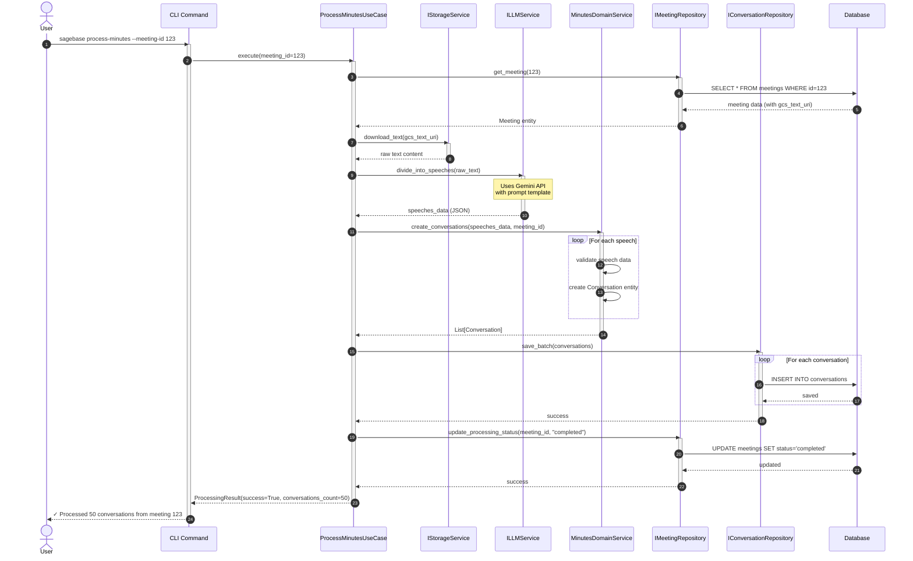
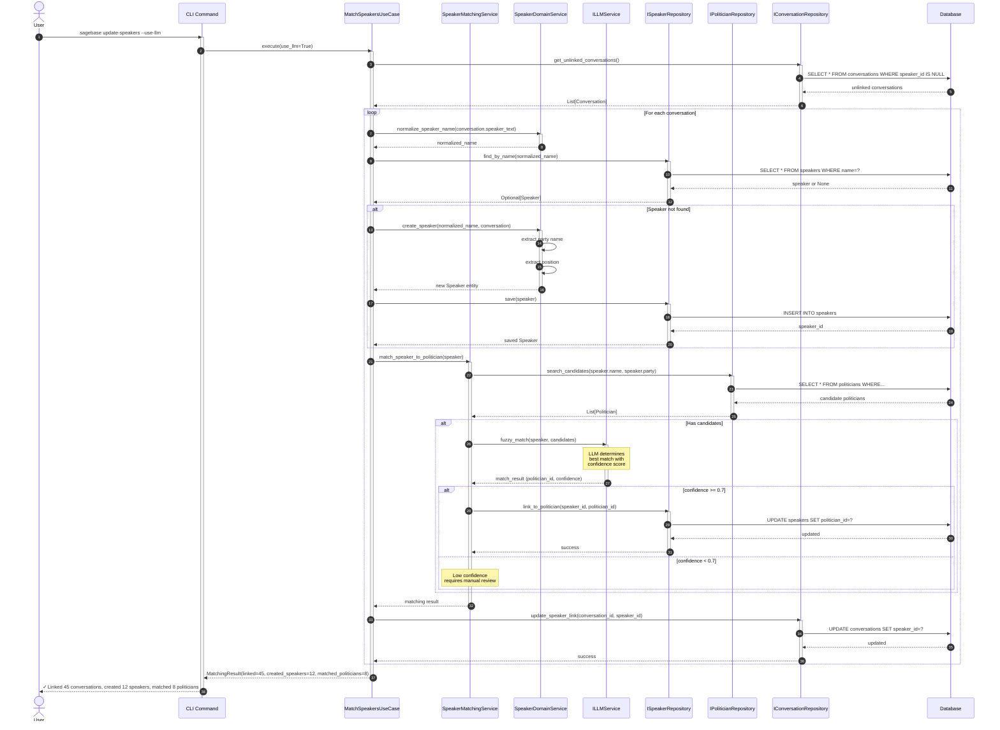
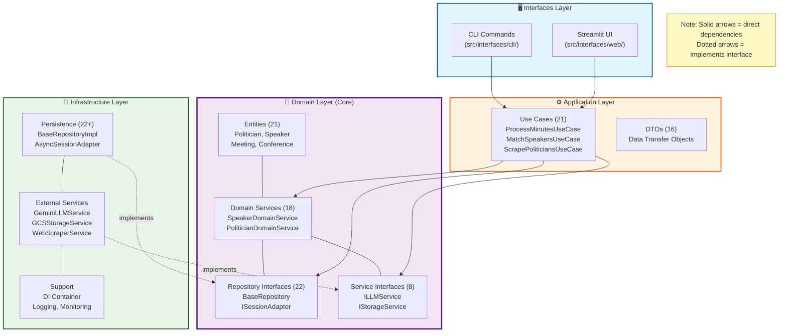

# 主要機能紹介

Sagebase（セージベース）は、日本の政治活動を追跡・分析するための先進的なアプリケーションです。本ページでは、Sagebaseの主要な4つの機能と、それを支える技術的特徴をご紹介します。

---

## 📄 1. 議事録自動処理

### 概要

会議の議事録（PDFやテキスト）から発言を自動的に抽出・構造化し、データベースに保存します。手作業では膨大な時間がかかる議事録の処理を、効率的に自動化します。

### 価値提案

- **時間削減**: 数百ページの議事録を数分で処理
- **高精度**: LangGraphによる多段階処理で正確な発言抽出
- **スケーラビリティ**: 全国1,966自治体の議事録に対応可能

### 技術特徴

- **LangGraph**: 複雑なワークフローを状態機械として管理
- **Google Gemini API**: 最新のLLMで高精度なテキスト解析
- **Google Cloud Storage**: PDFファイルを安全に保管
- **非同期処理**: 大量の議事録を効率的に並列処理

### 処理フロー



---

## 👥 2. 政治家データベース（全国1,966自治体対応）

### 概要

日本全国の政治家情報を網羅的に管理します。国会議員から都道府県議、市町村議まで、1,966すべての自治体をカバーします。

### 価値提案

- **網羅性**: 全国すべての自治体（国、47都道府県、1,918市町村）
- **最新性**: 政党ウェブサイトから自動的にデータを収集・更新
- **正確性**: 組織コードによる自治体の一意識別

### 技術特徴

- **Web Scraping**: Playwrightによる動的サイト対応
- **マスターデータ管理**: governing_bodiesテーブルで全自治体を管理
- **段階的処理**: 議員抽出→レビュー→承認のワークフロー
- **重複排除**: ドメインサービスによる政治家の自動重複検出

### データカバレッジ

- **国**: 1自治体（日本国政府）
- **都道府県**: 47自治体
- **市町村**: 1,918自治体（全市町村対応）
- **合計**: 1,966自治体

---

## 🤖 3. LLMベース発言者マッチング

### 概要

議事録中の発言者名を実際の政治家に自動的に紐付けます。従来の単純な文字列マッチングでは困難だった日本語特有の表記揺れに対応します。

### 価値提案

- **高精度マッチング**: LLMによる文脈理解で90%以上の精度
- **表記揺れ対応**: 敬称、漢字バリエーション、名前の順序などに対応
- **信頼性**: 信頼度スコアによる自動/手動判定の切り分け

### 技術特徴

- **ハイブリッドアプローチ**: ルールベース + LLMの組み合わせ
- **段階的マッチング**:
  1. 名前の正規化
  2. 候補者検索（名前・政党・期間）
  3. LLMによるファジーマッチング
  4. 信頼度評価
- **信頼度閾値**:
  - 高（≥0.9）: 自動リンク
  - 中（0.7-0.9）: 自動リンク + ログ記録
  - 低（0.5-0.7）: 手動レビュー
  - 極低（<0.5）: マッチなし

### マッチングフロー



### なぜLLMマッチングが必要か？

日本語の議事録には様々な表記揺れがあります：

- **敬称**: 山田太郎君、山田議員、山田太郎
- **順序**: 太郎山田 vs 山田太郎
- **漢字バリエーション**: 齊藤 vs 斉藤 vs 斎藤

従来の文字列マッチングではこれらの揺れに対応できませんが、LLMは文脈を理解して正確にマッチングできます。

---

## 📊 4. BIダッシュボード

### 概要

Plotly Dashを使用したインタラクティブなデータカバレッジ可視化ツールです。全国の自治体におけるデータ収集状況をリアルタイムで確認できます。

### 価値提案

- **視覚的理解**: 円グラフ、棒グラフ、テーブルで直感的に把握
- **リアルタイム更新**: 最新のデータベース情報を即座に反映
- **詳細分析**: 都道府県別、組織タイプ別のカバレッジ比較

### 主な機能

1. **全体カバレッジ率**: 円グラフでデータ取得状況を可視化
2. **組織タイプ別カバレッジ**: 国/都道府県/市町村別の棒グラフ
3. **都道府県別カバレッジ**: 上位10都道府県の詳細テーブル
4. **リアルタイム更新**: 更新ボタンでデータを再取得

### 技術スタック

- **Dash 2.14.2**: Plotlyのダッシュボードフレームワーク
- **Plotly 5.18.0**: インタラクティブグラフライブラリ
- **Pandas 2.1.4**: データ処理
- **SQLAlchemy 2.0.23**: ORMとデータベース接続

### アクセス方法

```bash
# Docker Composeで起動
docker compose -f docker/docker-compose.yml up -d bi-dashboard

# ブラウザでアクセス
# http://localhost:8050
```

---

## 🏗️ 技術的特徴

Sagebaseは、保守性と拡張性を重視した**Clean Architecture**に基づいて設計されています。

### Clean Architectureの4層構造



### 主要な設計原則

1. **依存性逆転の原則**: 依存関係は内側（Domain層）に向かう
   - Interfaces → Application → Domain ← Infrastructure

2. **Domain層の独立性**: ビジネスロジックはフレームワークに依存しない
   - 純粋なPythonコードのみ
   - 外部サービスはインターフェースで抽象化

3. **テスタビリティ**: 各層を独立してテスト可能
   - Domain層は外部サービスなしでテスト
   - Infrastructure層は簡単に差し替え可能

### その他の技術的特徴

- **型安全性**: Python型ヒントとpyrightによる静的型チェック
- **コード品質**: Ruffによる自動フォーマットとリント
- **非同期処理**: async/awaitによる高パフォーマンス
- **コンテナ化**: Docker Composeによる一貫した開発環境
- **CI/CD**: GitHub Actionsによる自動テスト・デプロイ

---

## 💡 ユースケース

Sagebaseは、様々なユーザーに価値を提供します。

### 研究者向け

- **学術研究**: 政治家の発言パターンや投票行動の分析
- **データセット構築**: 構造化された議事録データのエクスポート
- **時系列分析**: 長期的な政治動向の追跡

### ジャーナリスト向け

- **ファクトチェック**: 政治家の過去の発言を迅速に検索
- **記事作成**: データに基づいた政治報道の作成
- **透明性の向上**: 政治活動の可視化と公開

### 市民向け

- **情報アクセス**: 地元議員の活動を簡単に確認
- **政治参加**: データに基づいた投票判断
- **監視**: 政治家の公約と実際の行動の比較

---

## まとめ

Sagebaseは、最新のLLM技術とクリーンアーキテクチャを組み合わせることで、政治活動の透明性向上に貢献します。全国1,966自治体をカバーする包括的なデータベースと、高精度な自動処理機能により、研究者・ジャーナリスト・市民すべてに価値を提供します。

### さらに詳しく

- [Sagebaseについて](/about)
- [GitHubリポジトリ](https://github.com/trust-chain-organization/sagebase)
- [お問い合わせ](/contact)
